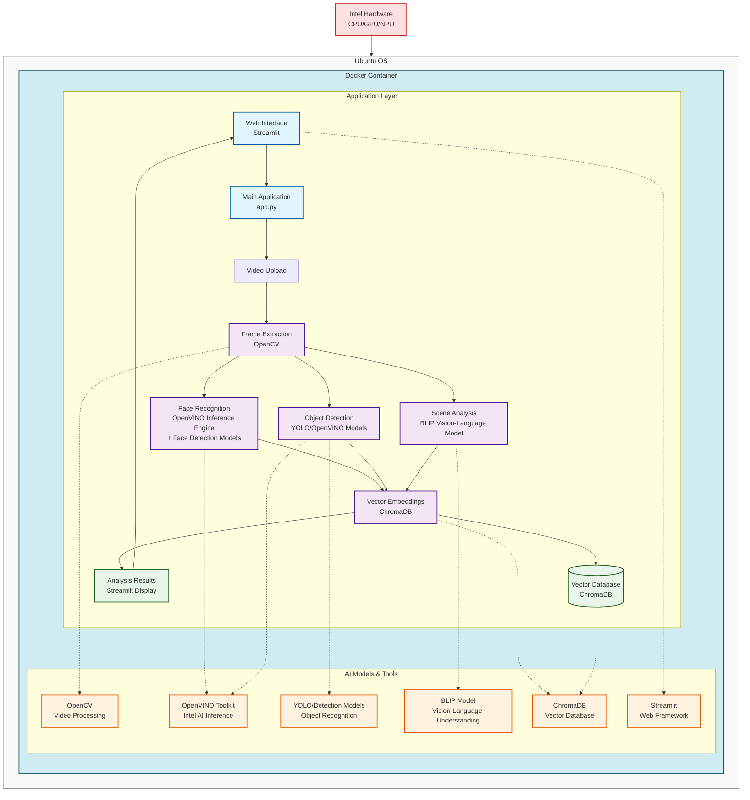

```mermaid
graph TB
    %% Infrastructure Layers
    subgraph OS[Ubuntu OS]
        subgraph DOCKER[Docker Container]
            subgraph APP_LAYER[Application Layer]
                %% User Interface
                UI[Web Interface<br/>Streamlit] --> APP[Main Application<br/>app.py]
                
                %% Input Processing
                APP --> UPLOAD[Video Upload]
                UPLOAD --> EXTRACT[Frame Extraction<br/>OpenCV]
                
                %% AI Processing Pipeline
                EXTRACT --> FACE[Face Recognition<br/>OpenVINO Inference Engine<br/>+ Face Detection Models]
                EXTRACT --> OBJECT[Object Detection<br/>YOLO/OpenVINO Models]
                EXTRACT --> SCENE[Scene Analysis<br/>BLIP Vision-Language Model]
                
                %% Data Processing
                FACE --> EMBED[Vector Embeddings<br/>ChromaDB]
                OBJECT --> EMBED
                SCENE --> EMBED
                
                %% Storage & Results
                EMBED --> VDB[(Vector Database<br/>ChromaDB)]
                EMBED --> RESULTS[Analysis Results<br/>Streamlit Display]
                RESULTS --> UI
            end
            
            %% AI Models & Libraries Layer
            subgraph MODELS[AI Models & Tools]
                OPENCV[OpenCV<br/>Video Processing]
                OPENVINO[OpenVINO Toolkit<br/>Intel AI Inference]
                BLIPMODEL[BLIP Model<br/>Vision-Language Understanding]
                CHROMADB[ChromaDB<br/>Vector Database]
                YOLO[YOLO/Detection Models<br/>Object Recognition]
                STREAMLIT[Streamlit<br/>Web Framework]
            end
            
            %% Connections between components and models
            EXTRACT -.-> OPENCV
            FACE -.-> OPENVINO
            OBJECT -.-> YOLO
            OBJECT -.-> OPENVINO
            SCENE -.-> BLIPMODEL
            EMBED -.-> CHROMADB
            VDB -.-> CHROMADB
            UI -.-> STREAMLIT
        end
    end
    
    %% Hardware Layer
    HW[Intel Hardware<br/>CPU/GPU/NPU] --> OS
    
    %% Styling
    classDef os fill:#f9f9f9,stroke:#666,stroke-width:1px
    classDef docker fill:#d1ecf1,stroke:#0c5460,stroke-width:2px
    classDef app fill:#e1f5fe,stroke:#01579b,stroke-width:2px
    classDef processing fill:#f3e5f5,stroke:#4a148c,stroke-width:2px
    classDef storage fill:#e8f5e8,stroke:#1b5e20,stroke-width:2px
    classDef models fill:#fff3e0,stroke:#e65100,stroke-width:2px
    classDef hardware fill:#ffe0e0,stroke:#c62828,stroke-width:2px
    
    class OS os
    class DOCKER docker
    class UI,APP app
    class EXTRACT,FACE,OBJECT,SCENE,EMBED processing
    class VDB,RESULTS storage
    class OPENCV,OPENVINO,BLIPMODEL,CHROMADB,YOLO,STREAMLIT models
    class HW hardware
```