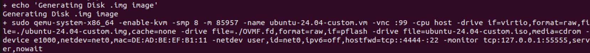
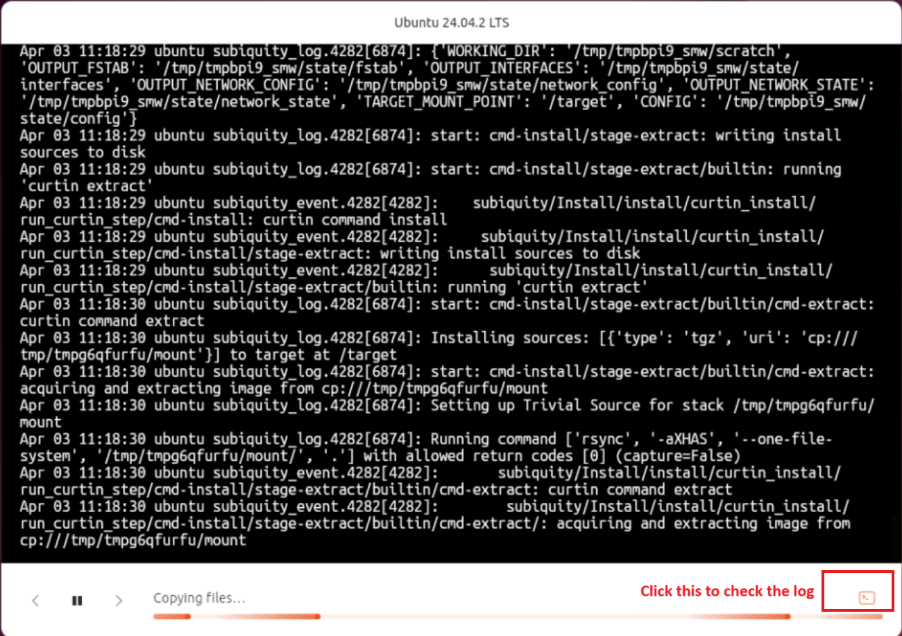
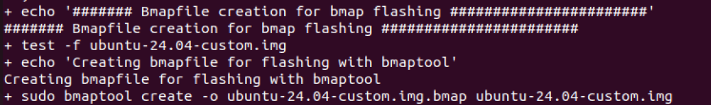
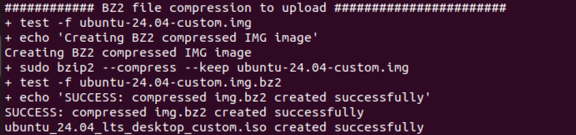

# Custom Ubuntu 24 Image with bz2 format
This automatic installation lets you answer all configuration questions ahead of time with an autoinstall configuration and lets the installation process run without any interaction. Then it will generate the image as .img.bz2 format.

## Minimum Requirement
Tested in Proxmox VM

CPU: 16 Core

Memory: 125G

Storage: 128GB

## Pre-requisites
1. Install the following
    ```bash
    sudo apt install qemu-utils qemu-kvm ovmf pbzip2 bmaptools
    ```

## Get Started
1. cd into Ubuntu24 folder
    ```bash
    cd ~/applications.platforms.network-and-edge-developer-kits/automation/OS/Ubuntu24
    ```

2. Configure `autoinstall_24.04.yaml` file according to your needs.
    > Reference link: https://canonical-subiquity.readthedocs-hosted.com/en/latest/reference/autoinstall-reference.html 
    
    > *NOTE: All the installation are run as root. 'user' account creation only happen after system reboot. Hence you not able to use 'user' account to do installation/configuration.

3. To generate image, run following command. Replace the ISO link if needed.
    ```bash
    sudo ./customize_ubuntu_iso_and_generate_img.sh -i https://releases.ubuntu.com/noble/ubuntu-24.04.2-desktop-amd64.iso
    ```

4.  The script will create VM to do the OS installation. 
    

5. You can view the VM and check the installation progress with command: `vncviewer localhost:99`
    > NOTE: To install vncviewer, go to https://www.realvnc.com/en/connect/download/viewer/linux/, download deb file. Copy over to your linux system, install using command : `sudo dpkg -i <deb file>`

6. You can check the installation log in the VM. It might take more than >20mins for installation.
    

7. Then the script will move on to create bmap if you need it.
    

8. Lastly, the script will compress the image into bz2 format. Compression might take 10-20mins. 
    