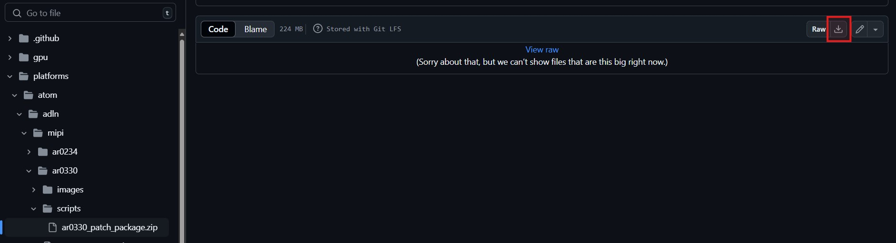
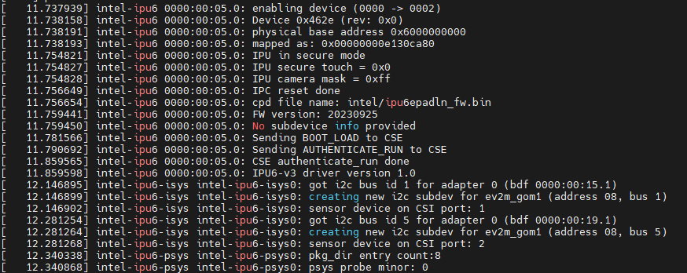
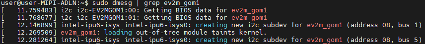
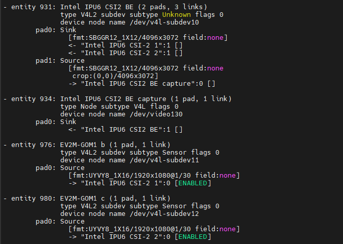
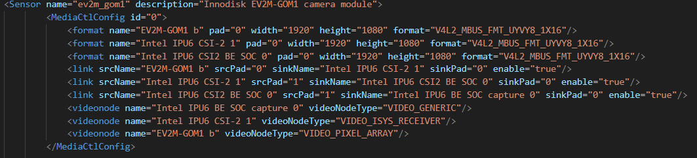
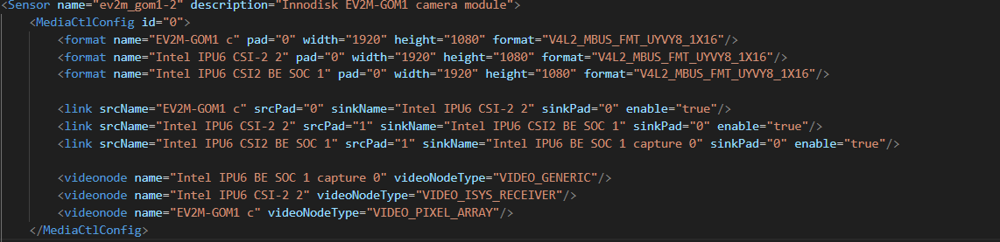
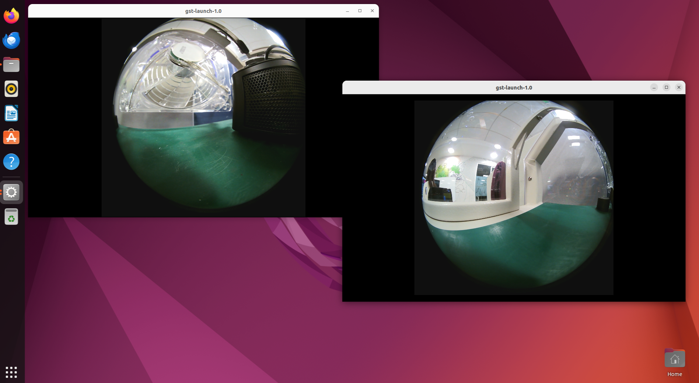
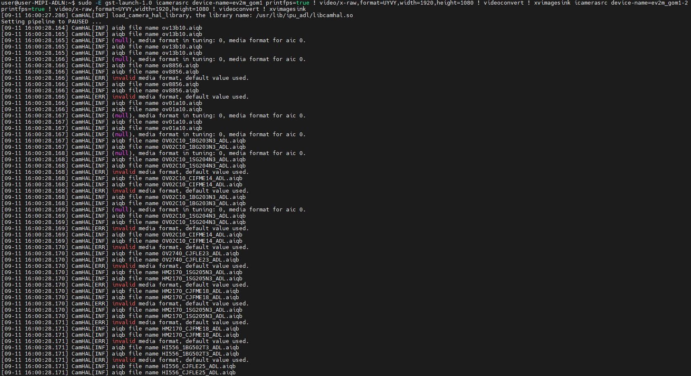
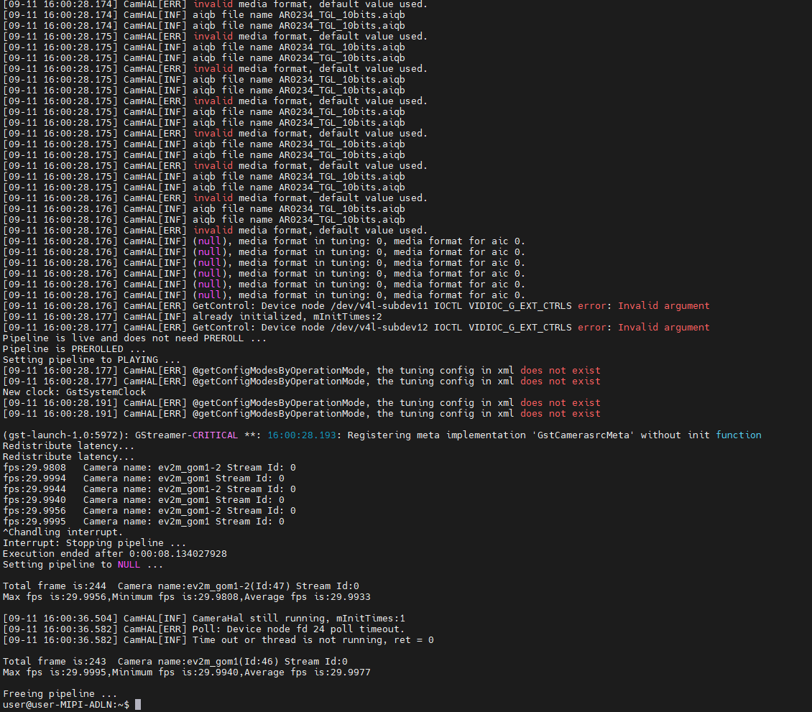

# MIPI AR0330 Setup Guide

This is setup guide for enabling MIPI AR0330 for Intel® Alder-Lake N processor.

## Requirements

Ensure that your system is set up properly. 
1. ADLN Setup: Refer to [ADLN Setup tutorial](../../README.md)
2. ADLN BIOS Setup: Refer to [BIOS Setup for MIPI AR0330](./BIOS_README.md)
3. AR0330 patch package: Download from [here](./scripts/ar0330_patch_package.zip)

#### Validated Hardware
- [AAEON UP Squared Pro 7000 (UPN-ADLNI3-A10-1664)](https://www.aaeon.com/en/p/up-board-up-squared-pro-7000)
- [INNODISK AR0330 MIPI](https://www.innodisk.com/en/products/embedded-peripheral/camera-module/ev2m-gom1?utm_term=&utm_campaign=APAC_MY_%E5%8B%95%E6%85%8B&utm_source=google&utm_medium=cpc&hsa_acc=8641245898&hsa_cam=20935934317&hsa_grp=158650007178&hsa_ad=690098342344&hsa_src=g&hsa_tgt=dsa-1456167871416&hsa_kw=&hsa_mt=&hsa_net=adwords&hsa_ver=3&gad_source=1&gclid=CjwKCAjwooq3BhB3EiwAYqYoEsEDNjahwtGYD53C6F3jE09Q4AptYhpWV6cEmQaZgNbDkVfH_BYBuhoC6OsQAvD_BwE)

#### How to download and prepare AR0330 patch package

1. Go to `ar0330_patch_package.zip` package in github repo.
2. Click [here](./scripts/ar0330_patch_package.zip) to access the page directly.
3. Click the button shown in the red square box.<br />
<br />
4. The patch package should start downloading shortly. Ensure that the package size is 224MB.
5. Go to setup directory, remove and replace existing .zip file 

```bash
cd edge-developer-kit-reference-scripts/platforms/atom/adln/mipi/ar0330/scripts
rm -rf ar0330_patch_package.zip
cp ~/Downloads/ar0330_patch_package.zip .
```

6. Unzip the patch package using the command 

```bash
sudo apt install unzip
unzip ar0330_patch_package.zip
```

## Go to specific setup directory

This step will redirect user to the current platform setup directory

```bash
cd edge-developer-kit-reference-scripts/platforms/atom/adln/mipi/ar0330
```

## Install Dependencies, Kernel Overlay and Binary
1. Install GStreamer

```bash
sudo apt-get install libgstreamer1.0-0 gstreamer1.0-plugins-base gstreamer1.0-plugins-good gstreamer1.0-plugins-bad gstreamer1.0-plugins-ugly gstreamer1.0-libav gstreamer1.0-tools libgstreamer-plugins-base1.0-dev
```

2. Install V4L2 Utilities

```bash
sudo apt-get install v4l-utils v4l2loopback-dkms
```

3. Run below command to load the patch package and change kernel to v6.2.

```bash
cd ar0330_patch_package
sudo ./install.sh
sudo reboot
```

## Validate AR0330 driver
 
1. To ensure IPU FW is probed and loaded properly, run this command.

```bash
sudo dmesg | grep ipu
```


2. Lastly check if AR0330 sensor(s) are detected.

```bash
sudo dmesg | grep ev2m_gom1
```

```bash
media-ctl -p
```


## Configuring the .xml file for AR0330 sensor
1. Go to the **ev2m_gom1.xml** file and edit the files accordingly for I2C b and I2C c port sensor. 

```bash
cd /etc/camera/ipu_adl/sensors/
sudo nano ev2m_gom1.xml
```

**EV2M_GOM1 b sensor configuration**


**EV2M_GOM1 c sensor configuration**



## Streaming the camera

1. Set environment variables with following commands.

```bash
cd edge-developer-kit-reference-scripts/platforms/atom/adln/mipi/ar0330/scripts
source setup_camera_env.sh
```

2. Launch the following command to see 
   ### Single camera stream

```bash
sudo -E gst-launch-1.0 icamerasrc device-name=ev2m_gom1 printfps=true ! video/x-raw,format=UYVY,width=1920,height=1080 ! videoconvert ! xvimagesink
```

   ### Dual camera stream
      
```bash
sudo -E gst-launch-1.0 icamerasrc device-name=ev2m_gom1 printfps=true ! video/x-raw,format=UYVY,width=1920,height=1080 ! videoconvert ! xvimagesink icamerasrc device-name=ev2m_gom1-2 printfps=true ! video/x-raw,format=UYVY,width=1920,height=1080 ! videoconvert ! xvimagesink
```

### Stream output
The images below shows the output for 2 AR0330 camera streams.





## Next Steps

Refer to the available use cases and examples below

1. [Intel® Distribution of OpenVINO™ Toolkit](../../../usecases/openvino/README.md)
2. [Intel® Edge Software Hub](https://www.intel.com/content/www/us/en/developer/topic-technology/edge-5g/edge-solutions/overview.html) 

