# LEOPARD IMX415 MIPI BIOS Setup Guide

This is BIOS setup guide for enabling LEOPARD IMX415 MIPI for Intel® Alder-Lake N processor.

## Requirements

- BIOS Version 2.4 (UNADAM24)
- BIOS can be downloaded from [AAEON UP SQUARED Pro 7000 Website](https://newdata.aaeon.com.tw/DOWNLOAD/BIOS/UP%20Squared%20Pro%207000,%207000%20EDGE(UPN-ADLN01)/UNADAM24.zip)

#### Validated Hardware
- [AAEON UP Squared Pro 7000 (UPN-ADLNI3-A10-1664)](https://www.aaeon.com/en/p/up-board-up-squared-pro-7000)
- LEOPARD IMX415 MIPI Camera

## BIOS Setup

1. Go to **CRB Setup** from BIOS main page.
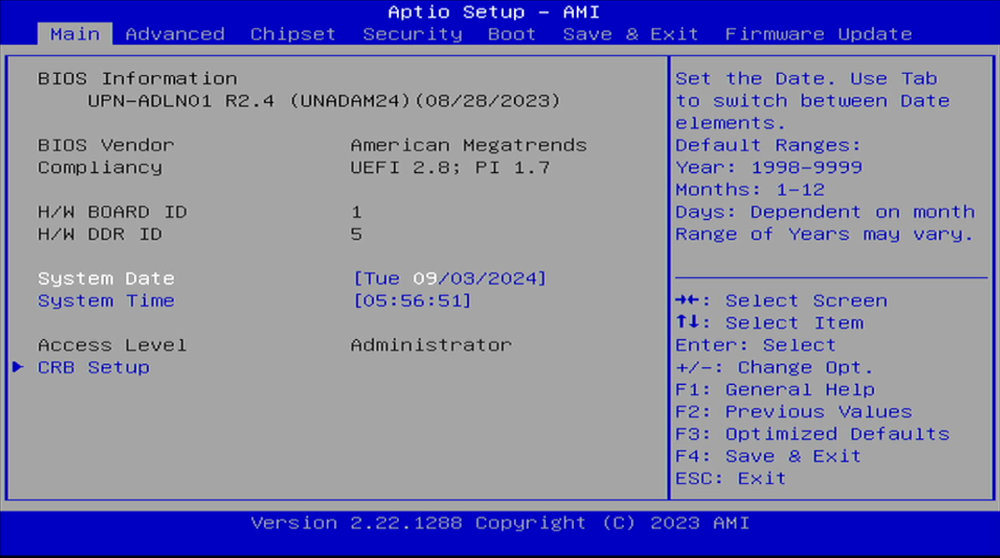

2. Select **CRB Chipset**.
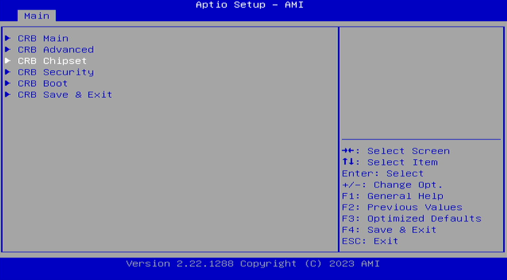

### 1. System Agent (SA) Configuration Setup

1. Select **System Agent (SA) Configuration**.
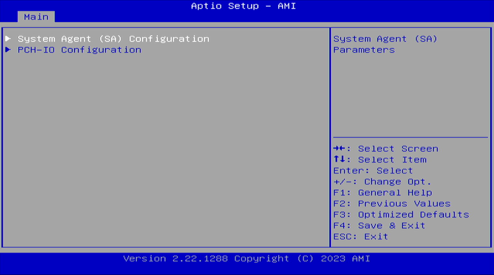

2. Disable **VT-d**, enable **IPU Device** and **IPU 1181 Dash Camera**. Select **MIPI Camera Configuration**.
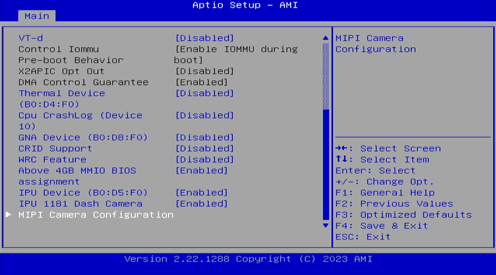

4. Enable **Control Logic 1** and **Control Logic 2**. Enable **Camera 1** and **Camera 2**.
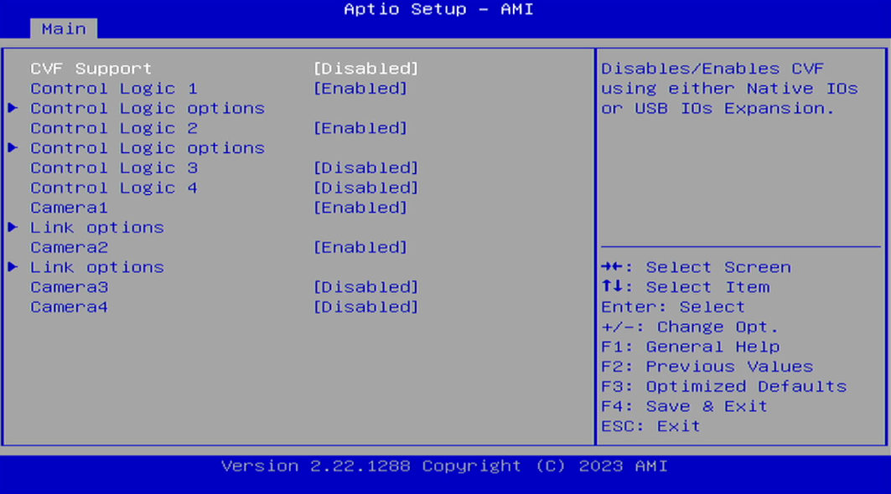

5. Set **Control Logic 1** based on the configuration shown below.
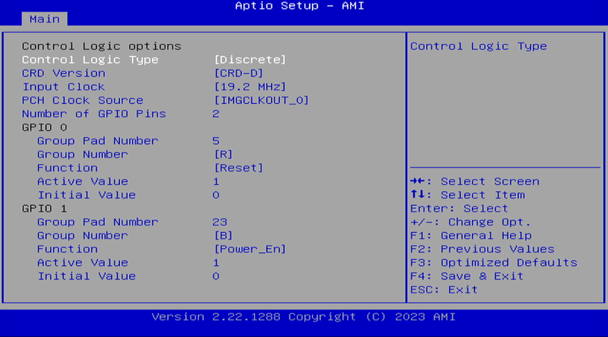

6. Set **Control Logic 2** based on the configuration shown below.
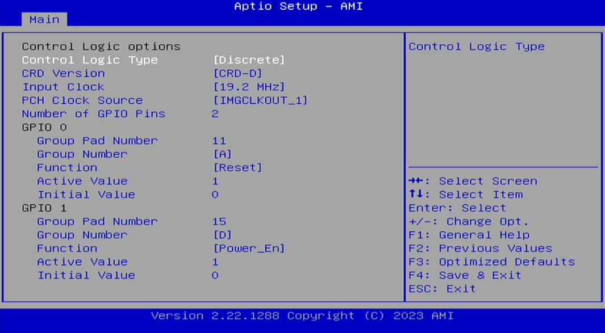

7. Set **Camera 1** based on the configuration shown below.
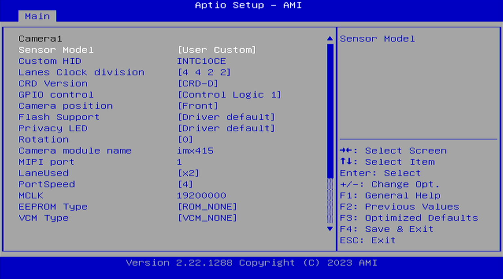
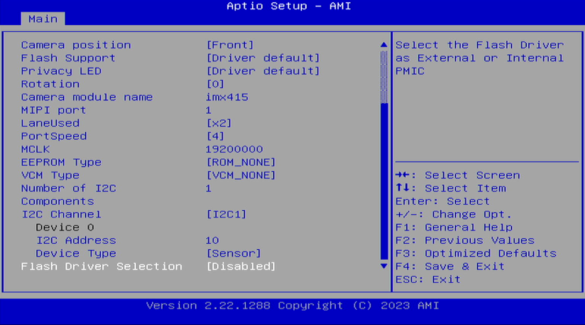

8. Set **Camera 2** based on the configuration shown below.
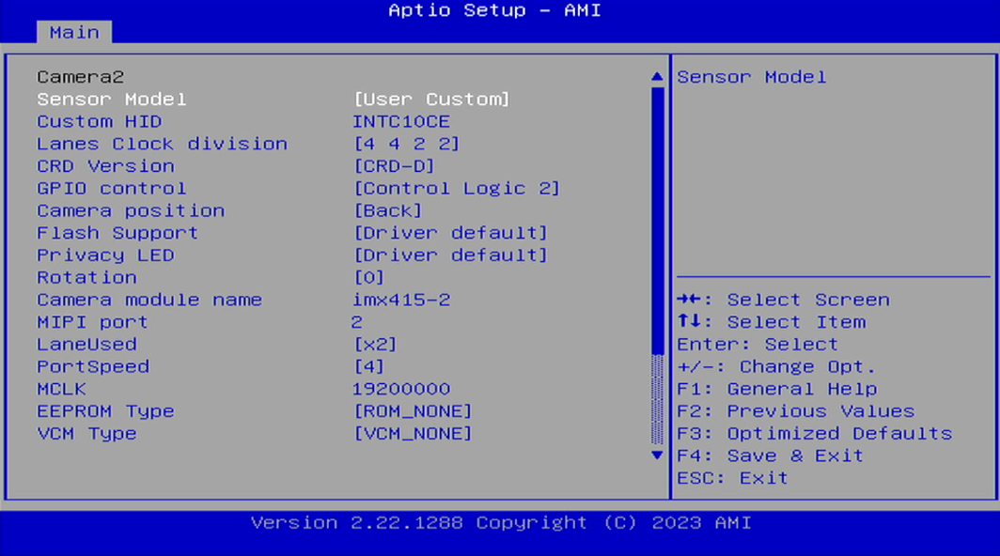
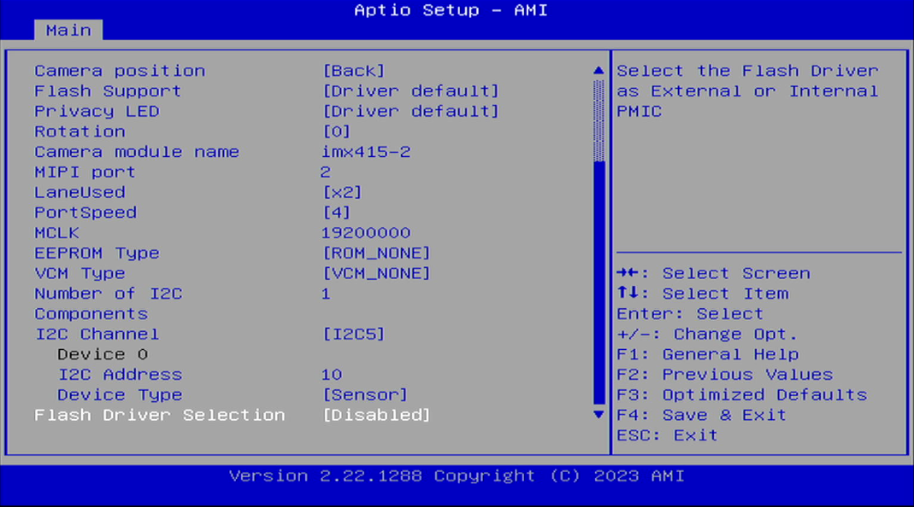

### 2. PCH-IO Configuration Setup

1. Select **PCH-IO Configuration**.
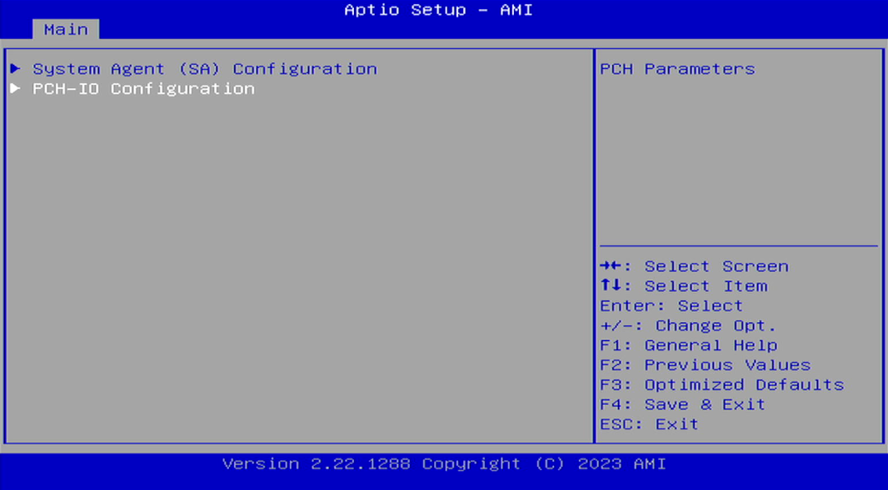

2. Go to **SerialIO Configuration**.
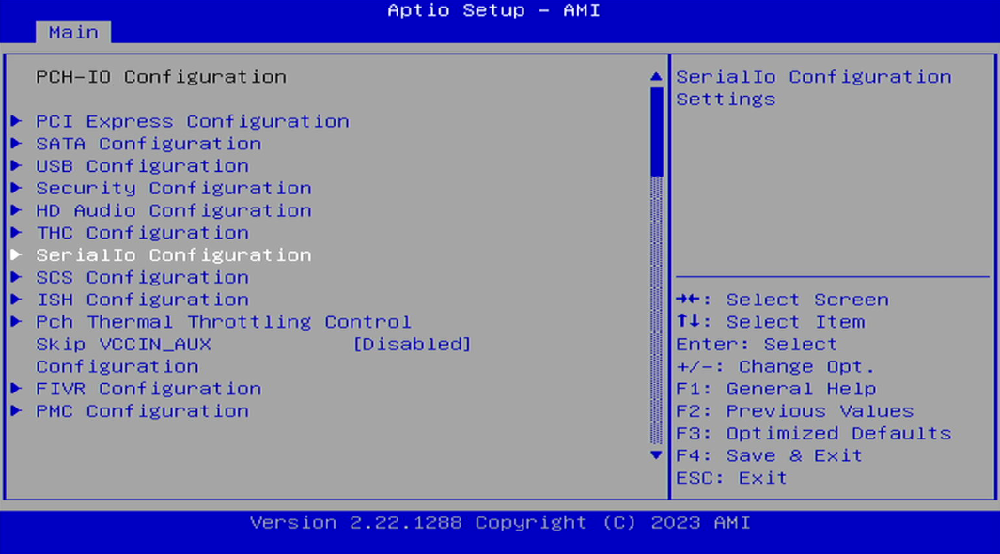

3. Enable **I2C1 Controller** and **I2C5 Controller**.
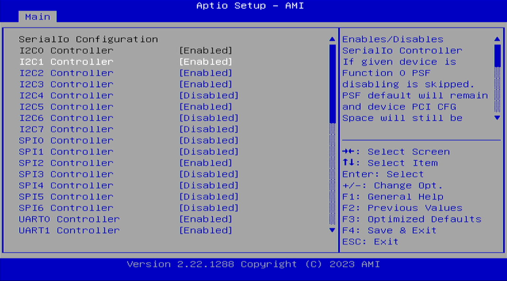

After all the steps are completed, press **F4** key to **save and exit**.
   
## Next Steps

Refer to the available use cases and examples below

1. [Run LEOPARD IMX415 MIPI on ADL-N Board](./README.md) 

