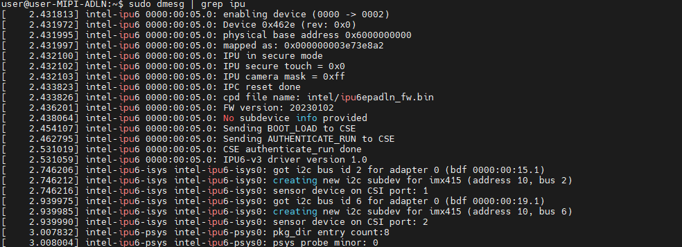
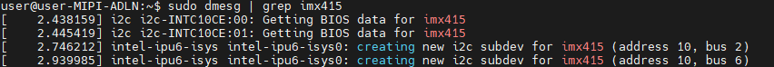
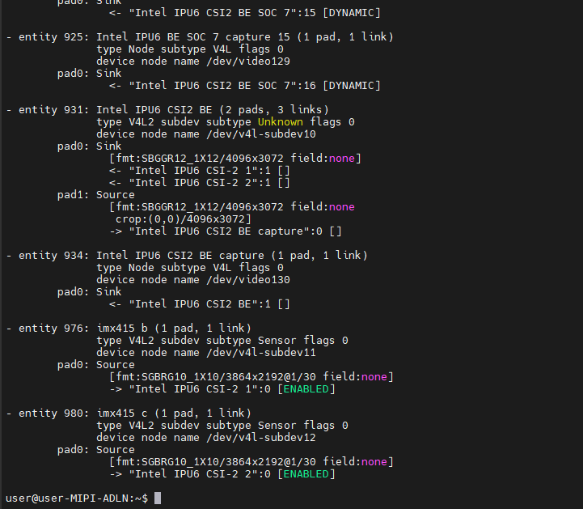
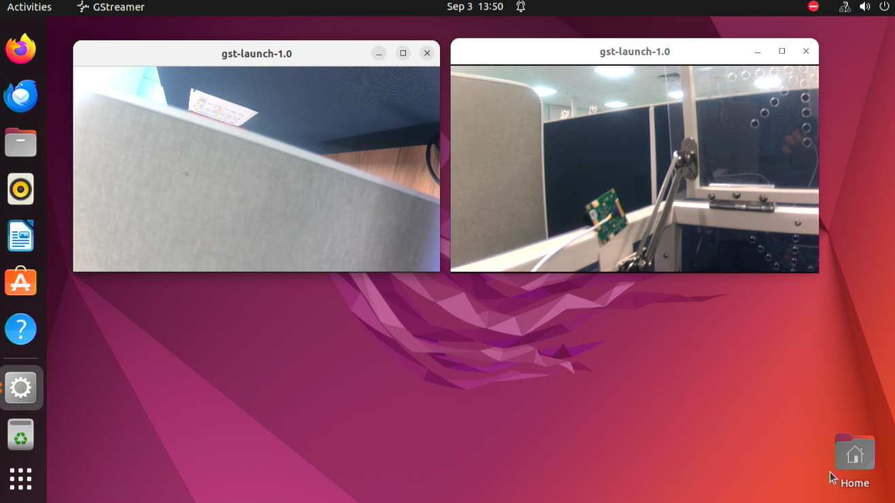
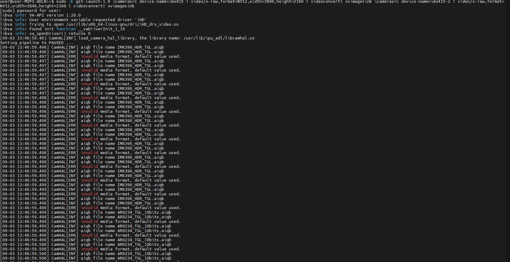
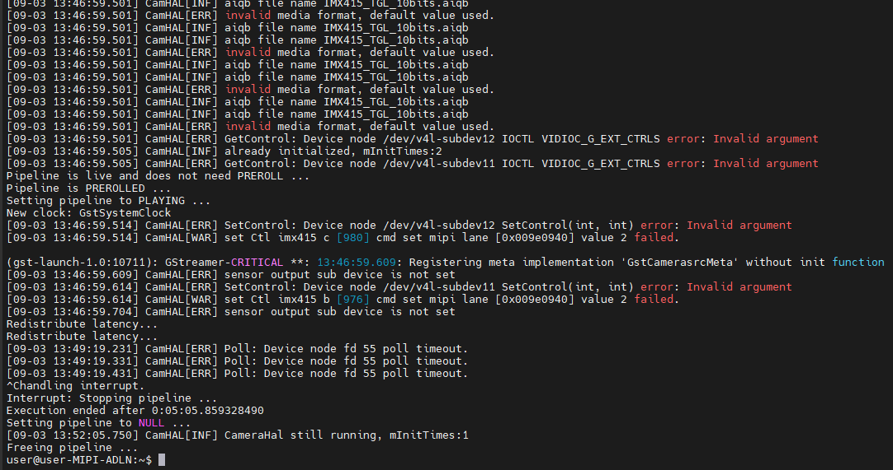

# MIPI IMX415 Setup Guide

This is setup guide for enabling MIPI IMX415 for Intel® Alder-Lake N processor.

## Requirements

Ensure that your system is set up properly. 
1. ADLN Setup: Refer to [ADLN Setup tutorial](../../README.md)
2. ADLN BIOS Setup: Refer to [BIOS Setup for MIPI IMX415](./BIOS_README.md)
3. Obtain IMX415 drivers, kernels and packages zip file from Leopard team by dropping an email here: Leopard Support <support@leopardimaging.com>

#### Validated Hardware
- [AAEON UP Squared Pro 7000 (UPN-ADLNI3-A10-1664)](https://www.aaeon.com/en/p/up-board-up-squared-pro-7000)
- [LEOPARD IMX415 MIPI](https://leopardimaging.com/product/robotics-cameras/cis-2-mipi-modules/i-pex-mipi-camera-modules/rolling-shutter-mipi-cameras/8-4mp-imx415/li-imx415-mipi-081h/)

## Go to the Specific Setup Directory

This step will redirect user to the current platform setup directory

```bash
cd edge-developer-kit-reference-scripts/platforms/atom/adln/mipi/imx415
```

## System Kernel Change
1. Run the command below to install the pre-built kernel v5.15.137.
   ```
   cd <zip_package_from_leopard>/imx415
   sudo dpkg -i linux-*.deb
   sudo update-grub
   sudo reboot
   ```

2.	Once the system reboots, choose and select **Kernel 5.15.137** under **‘Advanced Options for Ubuntu’**.

## Install the IPU Libraries
1. Run the script below to install the userspace IPU libraries. 
   ```
   cd edge-developer-kit-reference-scripts/platforms/atom/adln/mipi/imx415/scripts
   ./install_ipu.sh
   ```

2. After installing the userspace IPU libraries, run the script below to setup userspace IPU libraries. The system reboots after this command.
   ```
   ./setup_ipu.sh
   ```

3. Run the command below to copy the necessary drivers and packages from **Section: Requirements , Step 3** onto ADL-N board.
   ```
   cd <zip_package_from_leopard>/ISP/
   cp camera/IMX415_TGL_10bits.aiqb /usr/share/defaults/etc/camera/ipu_adl/
   cp camera/libcamhal_profile.xml /usr/share/defaults/etc/camera/ipu_adl/ 
   cp camera/sensors/imx415.xml /usr/share/defaults/etc/camera/ipu_adl/sensors/
   cp camera/gcss/graph_settings_imx415.xml /usr/share/defaults/etc/camera/ipu_adl/gcss/
   ```

## Validate IMX415 Driver
 
1. To ensure IPU FW is probed and loaded properly, run this command.
   ```
   sudo dmesg | grep ipu
   ```
   

2. Lastly check if IMX415 sensor(s) are detected.
   ```
   sudo dmesg | grep imx415
   ```
   
   ```
   media-ctl -p
   ```
   

### Streaming the Camera

1. Set environment variables with following commands.
   ```
   cd edge-developer-kit-reference-scripts/platforms/atom/adln/mipi/imx415/scripts
   source setup_camera_env.sh
   ```

2. Launch the following command to see 
      #### Single Camera Stream
      ```
      sudo -E gst-launch-1.0 icamerasrc device-name=imx415 printfps=true ! video/x-raw,format=NV12,width=3840,height=2160 ! videoconvert ! xvimagesink
      ```

      #### Dual Camera Stream
      ```
      sudo -E gst-launch-1.0 icamerasrc device-name=imx415 printfps=true ! video/x-raw,format=NV12,width=3840,height=2160 ! videoconvert ! xvimagesink icamerasrc device-name=imx415-2 printfps=true ! video/x-raw,format=NV12,width=3840,height=2160  ! videoconvert ! xvimagesink
      ```

#### Stream Output
The images below shows the output for 2 IMX415 camera streams.





## Next Steps

Refer to the available use cases and examples below

1. [Intel® Distribution of OpenVINO™ Toolkit](../../../../../usecases/ai/openvino/README.md)
2. [Intel® Edge Software Hub](https://www.intel.com/content/www/us/en/developer/topic-technology/edge-5g/edge-solutions/overview.html) 

