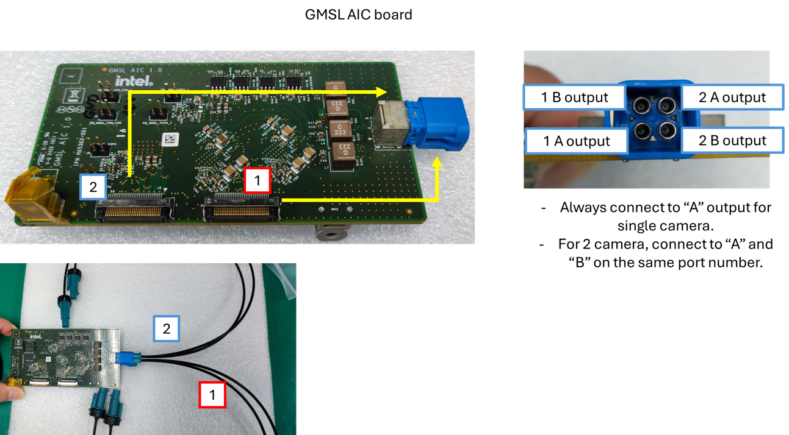
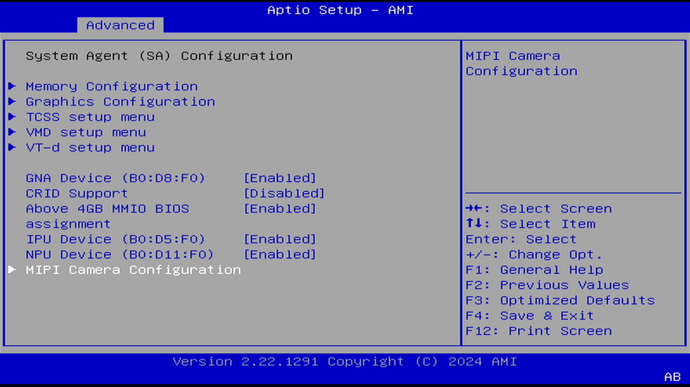
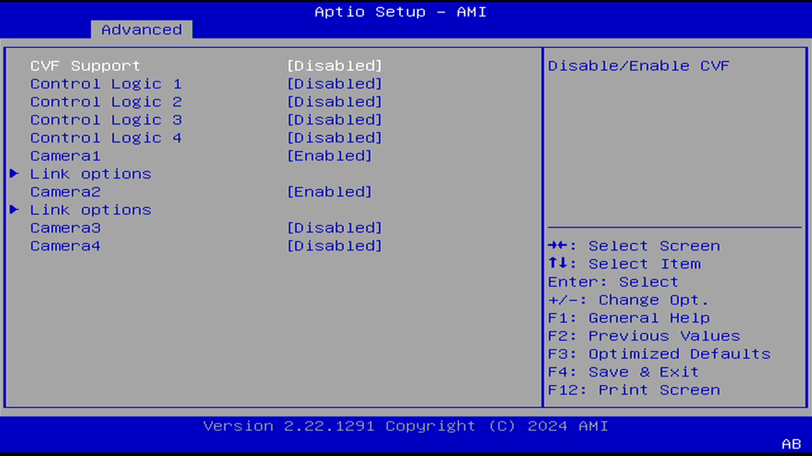
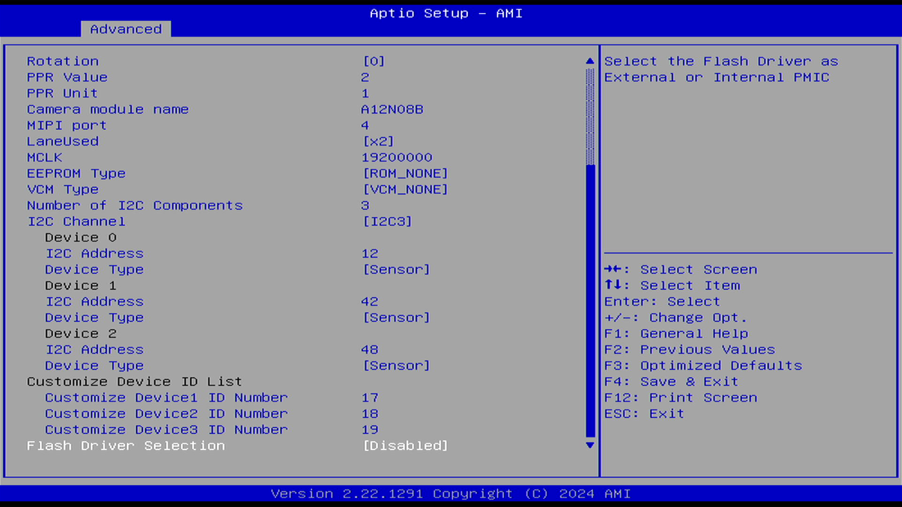
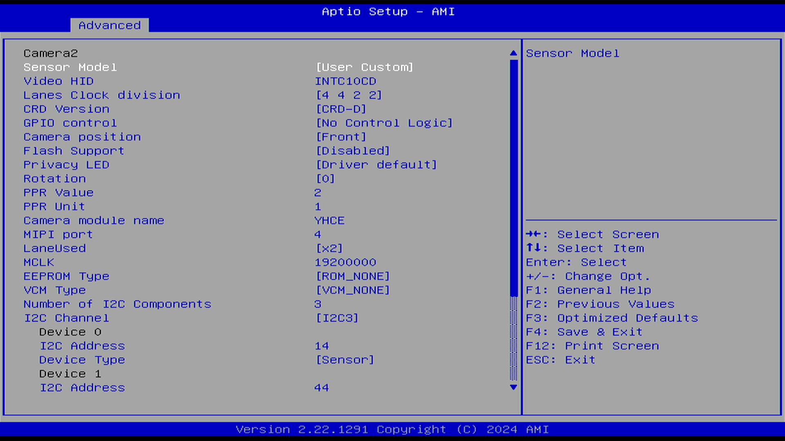
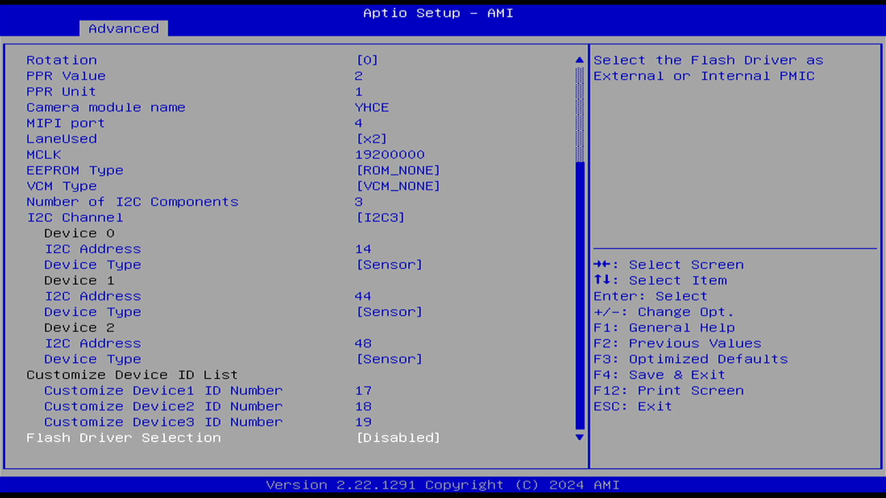

## Camera Hardware Setup 

Refer to the image below for the GMSL AIC connection to the RSD457 camera and the platform.
The connection and setup below are based on the Seavo* PIR-1014A AIoT Developer Kit.

- BIOS Version: M791A010

 

## BIOS Configuration

In your system’s BIOS, navigate to the **Advanced Settings** tab to start configuring the required settings.

**Step 1: Access MIPI Camera Settings**
   
   In your system’s BIOS, navigate to the **System Agent (SA) Configuration**.
   Enable **IPU Device** and tab into **MIPI Camera Configuration**.

   

    

**Step 2: Enable Camera 1 Settings**

   Locate the **Camera1** and **Camera2** section and click **Enabled**.

   

    

   Go to the **Link options** of Camera1 section and adjust the settings as shown in the image below to enable the first camera.

   

    

   

    

**Step 3: Enable Camera 2 Settings**

   Go to the **Link options** of Camera2 section and adjust the settings as shown in the image below to enable the second camera.

   

    

   

    

   

    

**Step 4: Save and Exit**

   Once all settings are configured correctly, navigate to the **Save & Exit** tab and select **Save Changes and Reset** to apply the new BIOS settings.