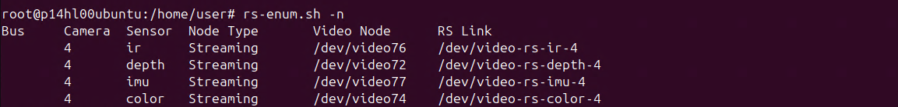
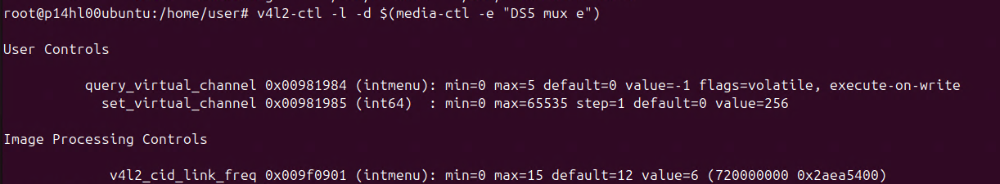
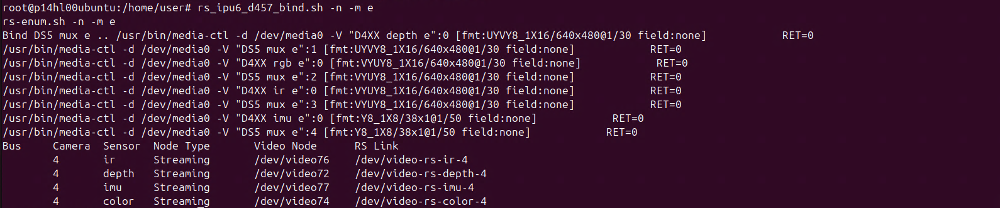
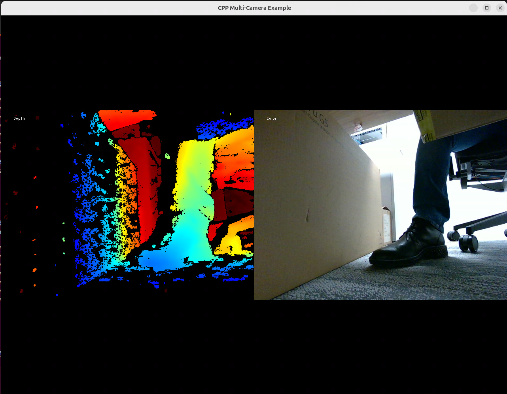

# D457/GMSL Camera Enablement

#### Validated Hardware
- [Seavo* PIR-1014A AIoT Developer Kit](https://www.seavo.com/en/pir_devkit/) with [Intel® RealSense™ Depth Camera D457](https://www.intelrealsense.com/depth-camera-d457/)
- [Advantech AFE-R360](https://www.advantech.com/en/products/8d5aadd0-1ef5-4704-a9a1-504718fb3b41/afe-r360/mod_1e4a1980-9a31-46e6-87b6-affbd7a2cb44) with [Advantech MIOe-GMSL](https://www.advantech.com/en/products/8d5aadd0-1ef5-4704-a9a1-504718fb3b41/mioe-mipi/mod_3c2c8e79-1891-4d38-83f7-8c6e209e7aab) with [Intel® RealSense™ Depth Camera D457](https://www.intelrealsense.com/depth-camera-d457/)


## Prerequisites

- Camera hardware and BIOS configured. Refer to [BIOS Setup for MTL GMSL D457](./BIOS_README.md)
- Ubuntu* 22.04 or Ubuntu* 24.04 installed.

## Quick Start

The steps below are tested for Ubuntu* 24.04. 

If you are using Ubuntu 22.04 refer to [ECI 3.3 Release for GMSL on MTL](https://eci.intel.com/docs/3.3/development/tutorials/enable-gmsl.html#intel-gmsl-intel-ipu6-debian-kernel-modules-dkms) to get started.

1. Download the [GPG-PUB-KEY-INTEL-SW-PRODUCTS.PUB](https://apt.repos.intel.com/intel-gpg-keys/GPG-PUB-KEY-INTEL-SW-PRODUCTS.PUB) and [GPG-PUB-KEY-INTEL-ECI.gpg](https://eci.intel.com/repos/gpg-keys/GPG-PUB-KEY-INTEL-ECI.gpg)

2. Run the script below to install the IPU6 DKMS via ECI. 
   ```
   cd edge-developer-kit-reference-scripts/platforms/coreultra/mtluh/camera/d457
   ./gmsl.sh
   ```

3. Run the command below after the installation is completed. 
   ```
   source /opt/ros/jazzy/setup.bash
   ```
4. Ensure camera enumerated successfully. In this case only 1 camera connected. 
   ```
   sudo rs-enum.sh -n
   ```
   

5. Change mux link frequency to 720 MHz for the connected camera by referring to 'RS LINK' from above command.
   ```
   sudo v4l2-ctl --set-ctrl v4l2_cid_link_freq=6 -d $(media-ctl -e "DS5 mux e")
   sudo dmesg | grep V4L2_CID_LINK_FREQ
   v4l2-ctl -l -d $(media-ctl -e "DS5 mux e")
   ```
   

6. Manually bind V4L2 Media Controller on all Intel® RealSense™ Depth Camera D457 GMSL muxes available on the system.
   ```
   rs_ipu6_d457_bind.sh -n -m e
   rs-enum.sh -n -m e
   ```
   

7. Run the rs-multicam for streaming. 
   ```
   rs-multicam
   ```
   
