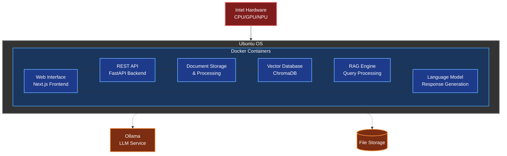

```mermaid
graph TB
    %% Infrastructure Layers
    subgraph OS[Ubuntu OS]
        subgraph DOCKER[Docker Containers]
            %% Linear Flow
            UI[Web Interface<br/>Next.js Frontend] --> API[REST API<br/>FastAPI Backend]
            API --> DOCS[Document Storage<br/>& Processing]
            DOCS --> VECTOR[Vector Database<br/>ChromaDB]
            VECTOR --> RAG[RAG Engine<br/>Query Processing]
            RAG --> LLM[Language Model<br/>Response Generation]
            LLM --> UI
        end
    end
    
    %% External Services
    DOCKER -.-> OLLAMA[Ollama<br/>LLM Service]
    DOCKER -.-> STORAGE[(File Storage)]
    
    %% Hardware Layer
    HW[Intel Hardware<br/>CPU/GPU/NPU] --> OS
    
    %% Styling with higher contrast colors
    classDef os fill:#333333,stroke:#999999,stroke-width:2px,color:#ffffff
    classDef docker fill:#1a365d,stroke:#4299e1,stroke-width:2px,color:#ffffff
    classDef flow fill:#1e3a8a,stroke:#60a5fa,stroke-width:2px,color:#ffffff
    classDef external fill:#7c2d12,stroke:#fb923c,stroke-width:2px,color:#ffffff
    classDef hardware fill:#7f1d1d,stroke:#f87171,stroke-width:2px,color:#ffffff
    
    class OS os
    class DOCKER docker
    class UI,API,DOCS,VECTOR,RAG,LLM flow
    class OLLAMA,STORAGE external
    class HW hardware
```