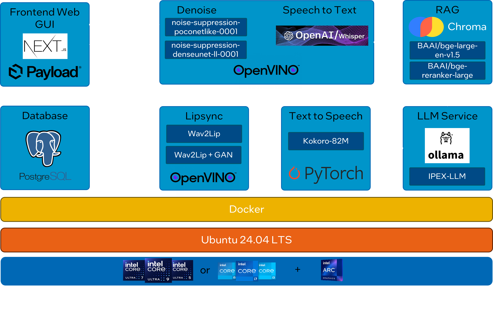

# Digital Avatar

A digital avatar that utilizes Text To Speech, Speech To Text, and LLM to create an interactive avatar.


## Table of Contents
- [Architecture Diagram](#architecture-diagram)
- [Requirements](#requirements)
  - [Minimum](#minimum)
- [Application Ports](#application-ports)
- [Setup](#setup)
  - [Prerequisite](#prerequisite)
  - [Setup ENV](#setup-env)
  - [Build Docker Container](#build-docker-container)
  - [Start Docker Container](#start-docker-container)
  - [Access the App](#access-the-app)
- [Notes](#notes)

## Architecture Diagram


## Requirements

### Minimum
- CPU: 13th generations of Intel Core i5 and above
- GPU: Intel® Arc™ A770 graphics (16GB)
- RAM: 32GB
- DISK: 256GB

## Application Ports
Please ensure that you have these ports available before running the applications.

| Apps         | Port |
|--------------|------|
| Lipsync      | 8011 |
| RAG          | 8012 |
| TTS          | 8013 |
| STT          | 8014 |
| OLLAMA       | 8015 |
| Liveportrait | 8016 |
| Frontend     | 80   |

## Setup

### Prerequisite
1. **OS**: Ubuntu (Validated on 24.04)
1. **Docker and Docker Compose**: Ensure Docker and Docker Compose are installed. Refer to [Docker installation guide](https://docs.docker.com/engine/install/).
1. **Intel GPU Drivers**:
    1. Refer to [here](../../../README.md#quick-start) to install Intel GPU Drivers
1. **Download the Wav2Lip Models**:
    ```bash
    # Navigate to the weights directory
    cd weights
    
    # Download both required model files
    wget -O wav2lip.pth "https://huggingface.co/numz/wav2lip_studio/resolve/main/Wav2lip/wav2lip.pth?download=true"
    wget -O wav2lip_gan.pth "https://huggingface.co/numz/wav2lip_studio/resolve/main/Wav2lip/wav2lip_gan.pth?download=true"
    
    # Return to the main directory
    cd ..
    ```
1. **Create Avatar**:
    1. Place a `default.mp4` file in the `assets/avatar-skins` folder. The video should feature an idle person (preferably showing at least the upper half of the body) with subtle movements like blinking or slight body motion, and **no speaking**. Ensure the file is named **`default.mp4`**.

### Setup ENV
1. Create a `.env` file and copy the contents from `.env.template`:
    ```bash
    cp .env.template .env
    ```
2. Set the `POSTGRES_PASSWORD` and `FRONTEND_PAYLOAD_SECRET` in the `.env` file.
* Note: Modify the `LLM_MODEL` in the `.env` file in order to change the initial LLM used by ollama. Refer to [Ollama library](https://ollama.com/library) for available models. (Default is `QWEN2.5`).


### Build Docker Container
```bash
docker compose build
```

### Start Docker container
```bash
export RENDER_GROUP_ID=$(getent group render | cut -d: -f3)
docker compose up -d
```

### Access the App
To access the web UI and interact with the application, use the following URLs:
- Main Web Application: http://localhost
- PayloadCMS Dashboard: http://localhost/admin
  - Note: Authenticate yourself at the PayloadCMS Dashboard to use the performance results features.

## Notes
### Device Workload Configurations
You can offload model inference to specific initial device by modifying the environment variable setting in the docker-compose.yml file.

| Workload                       | Environment Variable |Supported Device         | 
|--------------------------------|----------------------|-------------------------|
| LLM                            |            -         |        GPU(D)              |
| STT                            | STT_DEVICE           | CPU(D) ,GPU, NPU             | 
| TTS                            | TTS_DEVICE           | CPU(D)                     |
| Lipsync (Wav2lip/Sadtalker)    | DEVICE               | CPU(D-wav2lip), GPU(D-sadtalker)                |

* Note: (D) = default device

Example Configuration:

* To offload the STT encoded workload to `NPU`, you can use the following configuration.

```
stt_service:
  ...
  environment:
    ...
    STT_DEVICE=NPU
    ...
```

## Limitations
### 1. Automatic Speech Recognition Compatibility
Automatic speech recognition functionality is not supported in Firefox. Please use Chrome for validated performance.
