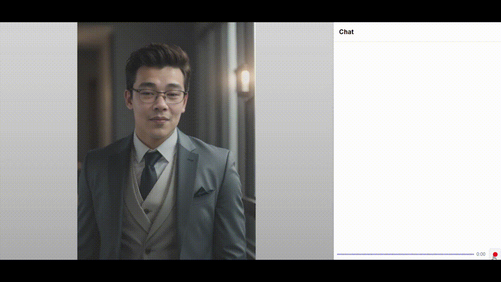

# Digital Avatar

A digital avatar that utilizes Image to Video, Text To Speech, Speech To Text, and LLM to create an interactive avatar.




## Table of Contents
- [Architecture Diagram](#requirements)
- [Requirements](#requirements)
  - [Minimum](#minimum)
- [Application Ports](#application-ports)
- [Setup](#setup)
  - [Prerequisite](#prerequisite)
  - [Setup ENV](#setup-env)
  - [Build Docker Container](#build-docker-container)
  - [Start Docker Container](#start-docker-container)
  - [Access the App](#access-the-app)
- [Notes](#notes)

## Architecture DIagram


## Requirements

### Minimum
- CPU: 13th generations of Intel Core i5 and above
- GPU: Intel® Arc™ A770 graphics (16GB)
- RAM: 32GB
- DISK: 128GB

## Application Ports
Please ensure that you have these ports available before running the applications.

| Apps         | Port |
|--------------|------|
| Lipsync      | 8011 |
| LivePortrait | 8012 |
| TTS          | 8013 |
| STT          | 8014 |
| OLLAMA       | 8015 |
| Frontend     | 80   |

## Setup

### Prerequisite
1. **OS**: Ubuntu (Validated on 22.04)
1. **Docker and Docker Compose**: Ensure Docker and Docker Compose are installed. Refer to [Docker installation guide](https://docs.docker.com/engine/install/).
1. **Intel GPU Drivers**:
    1. Refer to [here](../../../README.md#gpu) to install Intel GPU Drivers
1. **Download Wav2Lip Model**: Download the [Wav2Lip model](https://iiitaphyd-my.sharepoint.com/:u:/g/personal/radrabha_m_research_iiit_ac_in/EdjI7bZlgApMqsVoEUUXpLsBxqXbn5z8VTmoxp55YNDcIA?e=n9ljGW) and place the file in the `weights` folder.
1. **Create Avatar**:
    1. Place an `image.png` file containing an image of a person (preferably showing at least the upper half of the body) in the assets folder.
    2. Place an `idle.mp4` file of a person with some movement such as eye blinking (to be used as a reference) in the assets folder.

### Setup ENV
1. Create a `.env` file and copy the contents from `.env.template`:
    ```bash
    cp .env.template .env
    ```
2. Modify the `LLM_MODEL` in the `.env` file. Refer to [Ollama library](https://ollama.com/library) for available models. (Default is `QWEN2.5`).

### Build Docker Container
```bash
docker compose build
```

### Start Docker container
```bash
export RENDER_GROUP_ID=$(getent group render | cut -d: -f3)
docker compose up -d
```

### Access the App
- Navigate to http://localhost

## Notes
### Device Workload Configurations
You can offload model inference to specific device by modifying the environment variable setting in the docker-compose.yml file.

| Workload             | Environment Variable |Supported Device         | 
|----------------------|----------------------|-------------------------|
| LLM                  |            -         |        GPU              |
| STT                  | STT_DEVICE           | CPU,GPU,NPU             | 
| TTS                  | TTS_DEVICE           | CPU                     |
| Lipsync (Wav2lip)    | DEVICE               | CPU, GPU                |

Example Configuration:

* To offload the STT encoded workload to `NPU`, you can use the following configuration.

```
stt_service:
  ...
  environment:
    ...
    STT_DEVICE=CPU
    ...
```

## Limitations
### 1. Automatic Speech Recognition Compatibility
Automatic speech recognition functionality is not supported in Firefox. Please use Chrome for validated performance.
