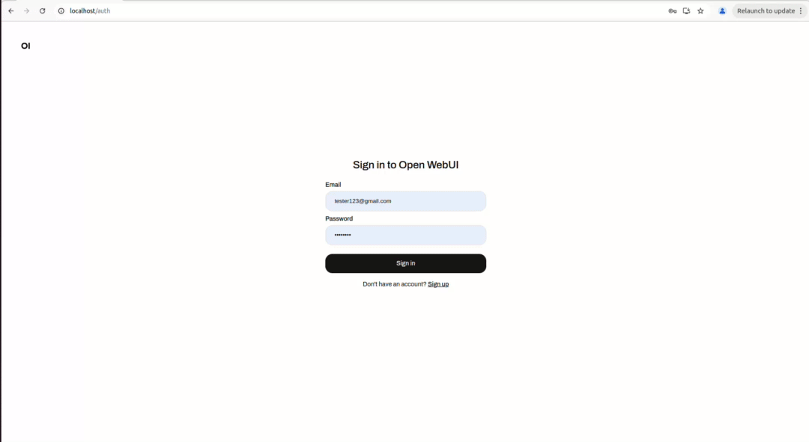
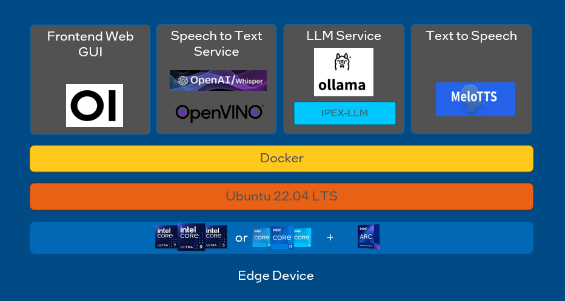

# OpenWebUI with Ollama
This repository provides detailed instructions and steps to successfully run OpenWebUI and Ollama on Intel platforms.

## Example


## High Level Architecture


## Validated Hardware
* CPU: Intel® Core™ Ultra 7 processors
* GPU: Intel® Arc™ graphics
* RAM: 16GB
* DISK: 128GB

## Prerequisite
### 1. Install operating system
Install the latest [Ubuntu* 22.04 LTS Desktop](https://releases.ubuntu.com/jammy/). Refer to [Ubuntu Desktop installation tutorial](https://ubuntu.com/tutorials/install-ubuntu-desktop#1-overview) if needed.

### 2. Docker Setup
Docker and docker compose should be setup before running the commands below. Refer to [here](https://docs.docker.com/engine/install/) to setup docker.

### 3. Install necessary GPU drivers.
   - Refer to [here](../../../gpu/arc/dg2/README.md) to setup GPU drivers

## Application ports
Please ensure that you have these ports available before running the applications.
| Apps       | Port |
|------------|------|
| Open WebUI |  80  |

## Device-Specific Workload Configuration
You can offload model inference to specific device by modifying the environment variable setting in the `docker-compose.yml` file.

| Workload             | Environment Variable |Supported Device        | 
|----------------------|----------------------|-------------------------|
| LLM                  |            -         |        GPU              |
| STT - Encoded Device | STT_ENCODED_DEVICE   | CPU,GPU,NPU             | 
| STT - Decided Device | STT_DECODED_DEVICE   | CPU,GPU                 |
| TTS                  | TTS_DEVICE           | CPU                     |

Example Configuration:

* To offload the STT encoded workload to `NPU`, you can use the following configuration.

```
stt_service:
  ...
  environment:
    ...
    STT_ENCODED_DEVICE=NPU
    STT_DECODED_DEVICE=CPU
    ...
```


## Quick Start
### 1. Build the Docker Container
```
docker compose build
```

### 2. Start the Docker Container
```
docker compose up -d
```
### 3. Access the Web UI
* Navigate to: http://localhost:80

### 4. Register the Default Admin User for the Web UI
* After signing up as the default admin user, you will be automatically redirected to the home page.


### 5. Configure OpenAI, TTS and STT API Link
* Open the Admin Panel from the top left corner.
* Click on `Settings`
* Replace OpenAI API link:
    * Click on `Connections`
    * Replace the OpenAI API link with `http://ollama-1:11434/v1`and provide any API Key.
    * Click on `Verify Connection` to ensure the server connection is verified.
    * Click `Save` button for save the changes

Example:


* Replace TTS and STT API links:
    * Click on `Audio`
    * For `Speech-to-Text Engine`, change from `whisper (local)` to `OpenAI`
    * Replace the OpenAI API link with `http://stt_service:5996/v1` and provide any API Key.
    * `Text-to-Speech Engine`, change from `Web API` to `OpenAI`
    * Replace the OpenAI API link with `http://tts_service:5995/v1` and provide any API Key.
    * Leave the STT Model, TTS Voice, and TTS Model fields empty (default TTS voice will be EN-US).
    * Click Save to save the changes.

Example:


### 9. Start New Chat
* Click on `New Chat`
* You may download the model from `Ollama.com` by entering the model name and selecting `Pull <model_name> from Ollama.com`.

    
* Click on `Arena Model` and select the target model (e.g., qwen2.5:latest).

    

### 10. Verify the LLM pipeline
#### LLM model
* LLM Model: Start interacting with the chat using the selected model.

    
* TTS Pipeline: Click on the `Read Aloud` icon to trigger the TTS API.

    
* STT Pipeline: Click on the `Record Voice` icon to start recording, and click again to stop. The generated text will appear in the input field.

    
