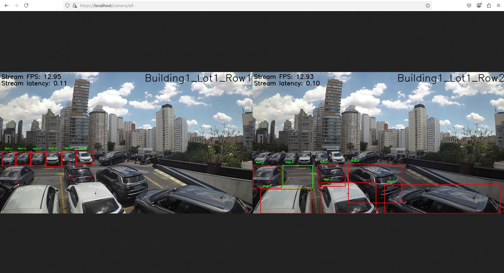
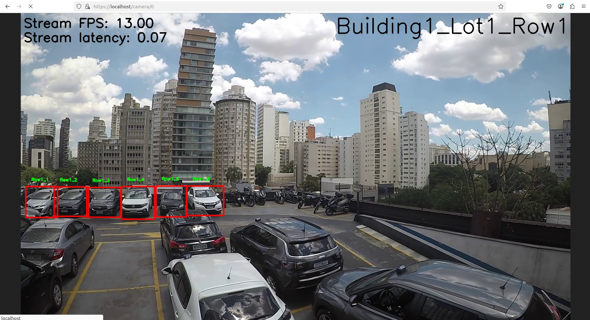
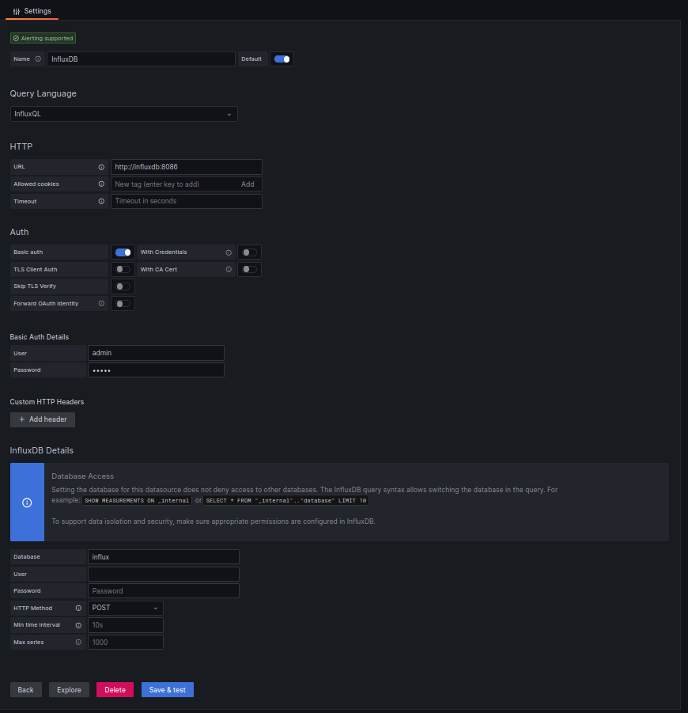
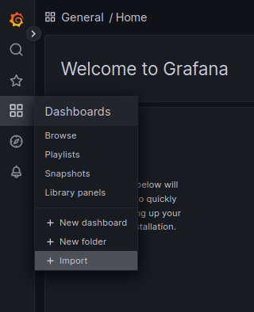

# Smart Parking Application

The smart parking application is an AI-based solution to monitor individual car parking spaces and their occupancy statuses in a car park. The model [vehicle-detection-0201](https://github.com/openvinotoolkit/open_model_zoo/blob/master/models/intel/vehicle-detection-0201/README.md) from Open Model Zoo is used for car detection in this application.


## Requirements
### Validated Hardware
* CPU: 13th generations of Intel Core processors and above
* GPU: Intel® Arc™ graphics
* RAM: 32GB
* DISK: 128GB

## Setup

### Prequisite
* **OS**: Ubuntu* (Validated on 22.04)

* **Docker and Docker Compose**: Ensure Docker and Docker Compose are installed. Refer to [Docker installation guide](https://docs.docker.com/engine/install/).

* **Intel GPU Drivers**:
Refer to [here](../../../README.md#gpu) to install Intel® GPU Drivers

### Generate SSL Certs

```
bash setup/generate-certs.sh
```

### Download Sample Video 

```
wget https://videos.pexels.com/video-files/30937634/13228649_1920_1080_30fps.mp4 -O server/resources/carpark_video_1.mp4
```

### Build Image

```
docker compose build
```

### Start Containers

```
docker compose up -d
```

### Stop Containers

```
docker compose down
```

### Access Streams

* View all camera streams: https://localhost/camera/all

  

* View specific camera stream: https://localhost/camera/<no_of_camera_stream>

  

### Grafana Dashboard

**Recommended web browser: Firefox**

1. Login
    - https://localhost/grafana/login
    - Username: admin
    - Password: admin

2. Add data source

    - Choose InfluxDB as the data source
    - Fill in URL
      - http://influxdb:8086
    - Turn on Auth and fill in the basic auth details
      - Username: admin
      - Password: admin
    - Fill in InfluxDB details
      - Database: carpark_data
      - HTTP Method: POST

    

    - Save and test

3. Import template from grafana folder

    

## Notes
### Model Configuration
You can change the model to pretrained YOLOv8-n by replacing line 37 and 38 in server/utils/video_stream.py with code below:

```
self.detector_yolo = CarDetectorYolo(f'./model/{model_name}_int8_openvino_model/{model_name}.xml', device="CPU")
self.detector_omz = None
```
