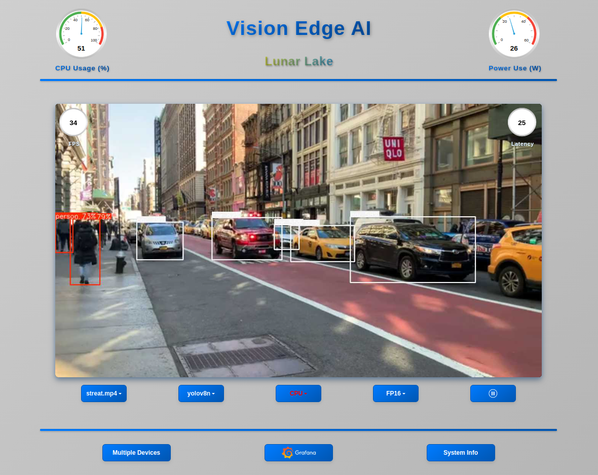

# VisionEdgeAI 

VisionEdgeAI is a Flask web application designed for real-time AI-based vision processing. It enables users to process and analyze video streams efficiently using AI models, all through a simple and interactive web interface. The application is Docker-based and Intel hardware agnostic, ensuring compatibility across various Intel platforms.

<p align="center">
  
</p>

---

## Features:
- **Web-based UI** for easy interaction.
- **Real-time AI inference** for vision tasks.
- **Supports multiple AI models**.
- **Optimized for CPU, GPU, and NPU acceleration**.

## Supported Distributions
This application currently supports the following Ubuntu versions:
- **Ubuntu 22.04**
- **Ubuntu 24.04**
- **Ubuntu 24.10**

## Installation Instructions

1. **Clone or Extract the Repository**  
   If you haven't already, clone or unzip the VisionEdgeAI project.

2. **Navigate to the Project Directory**  
   ```bash
   cd vision-edge-ai 
   ```

3. **Install Dependencies**  
   Run the following command to install prerequisites (kernel, GPU & NPU drivers, Docker):  
   ```bash
   make install_prerequisites
   ```  
   For detailed instructions on setting up dependencies, refer to the [tools/README.md](tools/README.md) file.

4. **Start the Application**  
   To start the application, run:  
   ```bash
   make
   ```

   By default, the application binds to 0.0.0.0, allowing it to be accessible from other machines. To restrict access to the local machine only, you can set the HOST_ADDRESS environment variable. To do this, run
   ```bash
   export HOST_ADDRESS="127.0.0.1" 
   ```

5. **Stop the Application**  
   To stop the application, run:  
   ```bash
   make stop
   ```

## Usage Instructions

1. **Open a Web Browser**  
   Once the Flask application starts, access it by opening the following URL in your browser:  
   ```
   http://<server-ip-address>
   ```  
   Replace `<server-ip-address>` with the IP address of the machine running the application.
   
## Customization

Personalize VisionEdgeAI to suit your needs with the following options:

### Adding a Custom Logo

Enhance the web interface by incorporating your own logo:

1. **Place Your Logo File**:  
   Copy your logo (e.g., `my_logo.png`) into the `./static/images/` directory.

2. **Set the Environment Variable**:  
   Export the `CUSTOM_LOGO_IMAGE` variable to point to your logo file. Run the following command in your terminal:  
   ```bash
   export CUSTOM_LOGO_IMAGE="my_logo.png"
   ```


## Enabling and Disabling Auto Start

To manage the automatic startup of the VisionEdgeAI service, use the following commands:

### Enable Auto Start
To enable the auto start feature, run:
```sh
	make enable_auto_start
```

### Disable Auto Start
To disable the auto start feature, run:
```sh
	make disable_auto_start
```
These commands ensure that the service does not automatically start upon system boot (when disabled) or does start automatically (when enabled).
