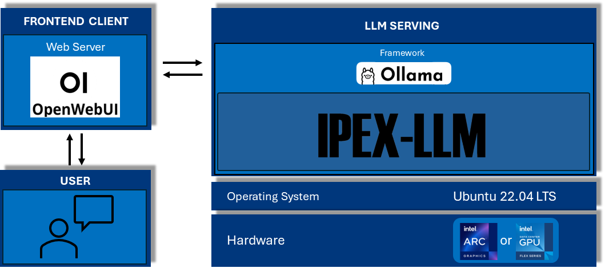

# Ollama with Open WebUI on Intel® Discrete GPU

## Requirements
### Validated Hardware
- [Asus NUC13RNGi9](https://www.asus.com/displays-desktops/nucs/nuc-kits/nuc-13-extreme-kit/) + Intel® Arc™ A770 Graphics


## Prerequisites
### Graphics Driver
- [Intel® Arc™ A-Series Graphics Driver](https://github.com/intel-innersource/applications.platforms.network-and-edge-developer-kits/tree/main/gpu/arc/dg2/)


## Software Architecture


*Figure 1: Software Architecture*

## Quick Start
### 1. Install operating system
Install the latest [Ubuntu* 22.04 LTS Desktop](https://releases.ubuntu.com/jammy/). Refer to [Ubuntu Desktop installation tutorial](https://ubuntu.com/tutorials/install-ubuntu-desktop#1-overview) if needed.


### 2. Download scripts
This step will download all reference scripts from the repository.
```bash
sudo apt install git
git clone https://github.com/intel/edge-developer-kit-reference-scripts
```

### 3. Go to specific setup directory
This step will redirect user to the current platform setup directory
```bash
cd edge-developer-kit-reference-scripts/usecases/ollama
```

### 4. Run setup script
This step will configure the basic setup of the installation. Make sure all of the requirements have been met before proceeding to the next step.
```
bash ./setup.sh
```
Installation is completed when you see this message:
> ✓ Setup Installed

### 5. Run serve script
This step will initialize and start the Ollama with Open WebUI Server.
```
bash ./serve.sh
```
> **Note:** You may press CTRL+C to stop the service.


### 6. Launch Open WebUI Interface
- [http://localhost:8080/](http://localhost:8080/)
