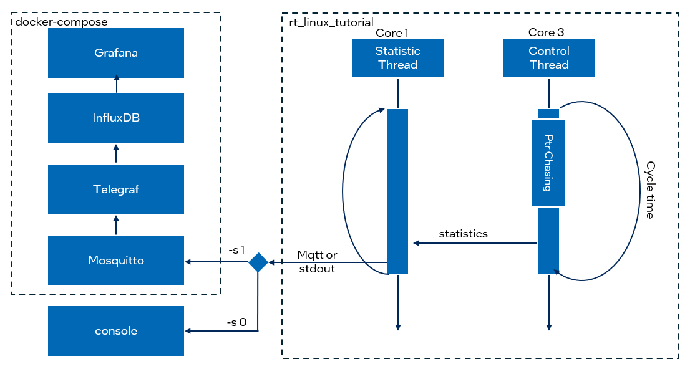
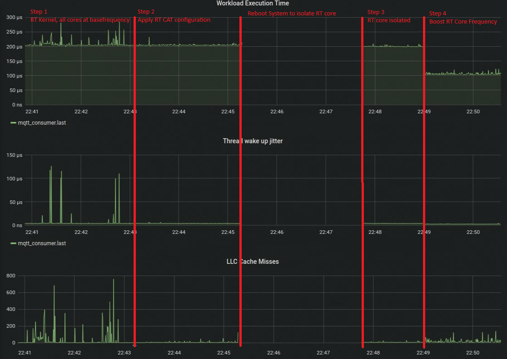

# Optimizing Linux Real-Time Performance on Intel CPUs: A Step-by-Step Guide

## Key Takeaways of this Tutorial
- **BIOS TCC Mode**
- **Linux Kernel Command-line tuning**
- **Cache Partitioning - Intel CAT**
- **Boost RT Performance - Intel Speed Shift for Edge**

## Validated hardware
- CPU: Intel® Core™ i5-1350PE processors
- RAM: 16GB
- DISK: 128GB

## Test Application

This application is used to demonstrate the possible optimization steps to increase temporal isolaten between best effort and real time workloads on Linux systems. It includes a control task that performs random pointer chasing to simulate a workload and measures wake up jitter, execution time and cache misses. The application also features a statistics handler thread that processes and logs timing information.

<span style="color:red"> Note: The pointer chasing buffer size should exceed the L2 cache size of your processor to see an improvment by cache partitioning described in step 2 below. You can change the buffer size in `rt_linux_tutorial.c` using `WORKLOAD_BUFFER_SIZE` define.</span>

## High-level Design of the test application

<p align="center">
  
</p>
Developer: Toggle developer tools
## 1. Step: Default Configuration

<p align="center">
  
</p>

#### Prerequisite
- Ubuntu real-time kernel installed - see section "Quick Start" section below.
- <span style="font-family: 'Courier New';">"Intel® TCC Mode"</span> enabled in BIOS

  With the Intel® reference BIOS the <span style="font-family: 'Courier New';">Intel® TCC Mode</span> can be enabled under <span style="font-family: 'Courier New';">"Intel® Advanced Menu > Time Coordinated Computing"</span>. Talk to your board vendor if the <span style="font-family: 'Courier New';">Intel® TCC Mode</span> is not visible or follow the steps listed in the "Intel® Core Processors Firmware Configuration" section of [TCC User Guide](https://cdrdv2.intel.com/v1/dl/getContent/831868?explicitVersion=true) and set the options manually.
- Locking All Cores to Base Frequency

  So far the recommendation to avoid any impact on real-time (RT) performance due to x86 power management features, has been to lock all cores to their base frequency. There are two methods to achieve this:
  1. Disable DVFS Features in BIOS (Legacy Method)
Turn off Dynamic Voltage and Frequency Scaling (DVFS) features such as Intel Speed Step, Speed Shift, or Turbo Boost technology directly in the BIOS settings.

  2. Enable DVFS Features and Configure via `intel_pstate` Driver
    
      **a.** Keep DVFS features like Intel Speed Step, Speed Shift, or Turbo Boost technology enabled in the BIOS.
    
      **b.** Use the `sysfs` attributes of the `intel_pstate` driver to set both the minimum (`scaling_min_freq`) and maximum (`scaling_max_freq`) allowed frequencies to the base frequency (`base_frequency`).
      ```sh
            cpu_dir = /sys/devices/system/cpu/cpu<core id>/cpufreq
            # Read the base frequency value
            base_freq=$(cat "$cpu_dir/base_frequency")
            
            # Write the base frequency value for each core to scaling_max_freq
            sudo bash -c "echo $base_freq > $cpu_dir/scaling_max_freq"
            # Write the base frequency value for each core to scaling_min_freq
            sudo bash -c "echo $base_freq > $cpu_dir/scaling_min_freq"
      ```
    
      **c.** Optimize core performance by setting the Energy Performance Preferences attribute (`energy_performance_preference`) to 0 (`performance`).
      ```sh
            cpu_dir = /sys/devices/system/cpu/cpu<core id>/cpufreq
            # Set energy_performance_preference to "performance" for each core by default
            sudo bash -c "echo performance > $cpu_dir/energy_performance_preference"
      ```
    
      **d.** Alternatively, you can directly access the Hardware-Controlled Performance (HWP) model-specific registers. For more details, refer to the [Intel Software Developer's Manual Vol.3 section "Hardware-Controlled Performacne States"](https://cdrdv2.intel.com/v1/dl/getContent/671200)  or the [TCC User Guide](https://cdrdv2.intel.com/v1/dl/getContent/831868?explicitVersion=true). 

    Simply use the script with `basefrequency` as input parameter to lock all cores to the respective base frequency.

    ```sh
      sudo ./setsetCoreFrequency.sh basefrequency
    ```  
#### Run first Test
Start real-time application and check the statistics on the Grafana dashboard. 
  ```sh
  sudo ./rt_linux_tutorial -s 1
  ```
### 2. Step: Partition the LLC(L3) Cache 
<p align="center">
  
</p>

Intel provides the ability to partition caches at various levels in the caching hierarchy through Cache Allocation Technology (CAT), part of Intel® Resource Director Technology (Intel® RDT).
- Partition the LLC to exclusively provide a portion of the L3 cache to the core the real-time app is running. 

  As depicted above the Last Level Cache (LLC) of i5-1350PE has a capacity bitmask (`CBM`) length of 8 (0xFF). For this tutorial LLC is partitioned in half, with P cores 0-2, all E cores and Gfx operating with Class of Service 0 (`CLOS 0`) being assigned half the cache and P cores 3 which will be used for real-time workloads, operating on Class of Service 1 (`CLOS 1`) the other half. Each class of service will be assigned a CBM length of 4 (0xF0 and 0xF0) when partitioning the cache in half. The MSRs used for configuring the cache masks are `L3_MASK_0` (address 0xC90), `L3_MASK_1` (address 0xC91) and `GT_MASK0` (address 0x18B0). The class  The MSR used for associating a class of service to a core is PQR_ASSOC (address 0xC8F). 
  
  This is just an example, and the configuration needs to be adjusted to your specific use case and processor. You can determine the cache topology, including the size and number of ways supported for a particular processor, by using the CPUID leaf "Deterministic Cache Parameters Leaf - 0x4." Additionally, Linux utilities like lstopo are very useful for getting an overview of the cache topology of a processor. Here are some references if you need more information ...
  
  
  - Public Intel® Time Coordinated Computing (TCC) User Guide - RDC #[831067](https://cdrdv2.intel.com/v1/dl/getContent/831067?fileName=Public+TCC+User+Guide+-+September+2024+-+RDC-831067.pdf)
  - Intel® Resource Director Technology (Intel® RDT) Architecture Specification - RDC #[789566](https://cdrdv2.intel.com/v1/dl/getContent/789566?fileName=356688-intel-rdt-arch-spec.pdf)
  - Intel® 64 and IA-32 Architectures Software Developer’s Manual - RDC#[671200](https://cdrdv2.intel.com/v1/dl/getContent/671200)
  
  Here is an example how the LLC can be partitioned with the Linux `msr-tools` ...
  ```sh
    #define LLC Core Masks
    wrmsr 0xc90 0xF0 # best effort
    wrmsr 0xc91 0x0F # real-time
    #define LLC GT Mask
    wrmsr 0x18b0 0x80
    
    #assign the masks to the cores.
    #This has to match with the core selected for the rt app
    wrmsr -a 0xc8f 0x0 # assign all cores to the CLOS0 
    wrmsr -p 3 0xc8f 0x100000000 # assign real-time core to CLOS1
  ```
  
  Simply use the script with `rt_optimized` which partitions the cache like depicted above or `default` for a flat partitioning ...
  ```sh
  sudo ./setCacheAllocation.sh rt_optimized
  ```  
- Start the real-time application if it is not already running and check the statistics on the Grafana dashboard. You should observe an improvement in cache misses and latency. However, there may still be some spikes in latency and cache misses, which we will address in the next optimization steps.
  ```sh
  sudo ./rt_time_linux_tutorial -s 1
  ```
### 3. Step: Isolating a core for the Real-time App
<p align="center">
  
</p>

- Add the following parameters to the kernel command line - /etc/default/grub
  ```sh
  GRUB_CMDLINE_LINUX="clocksource=tsc tsc=reliable nmi_watchdog=0 nosoftlockup isolcpus=3 rcu_nocbs=3 nohz_full=3 irqaffinity=0 "
  ```
- Don't forget to update grub and reboot the system to apply the optimizations.
  ```sh
  sudo update-grub
  sudo reboot now 
  ``` 
- Apply Optimizations done in step 1 and 2
- Start real-time application and check the statistics on the Grafana dashboard, you should see less cache misses and latency spikes on the real-time core.
  ```sh
  sudo ./rt_linux_tutorial -s 1
  ```
### 4. Step: Applying Speed Shift for Edge to boost the Real-time App
<p align="center">
  
</p>

- With Speed Shift for Edge Computing, the frequency of the real-time core can be boosted to leverage higher single-threaded performance. This tutorial follows the recommendations for the enveloping configuration listed in the [TCC User Guide](https://cdrdv2.intel.com/v1/dl/getContent/831067?fileName=Public+TCC+User+Guide+-+September+2024+-+RDC-831067) and in the Intel® 64 and IA-32 Architectures Software Developer’s Manual Vol3 section "Power and Thermal Management-Hardware Controlled Performance States - RDC#[671200](https://cdrdv2.intel.com/v1/dl/getContent/671200) 

  Therefore, the maximum allowed frequency of all best-effort cores is limited to the base frequency, and the Energy Performance Preferences (EPP) is set to `power`. This configuration allows the best-effort cores to scale their frequency between the minimum and base frequency depending on core utilization.

  For the real-time core, the frequency is boosted to 3.1GHz, and the Energy Performance Preferences (EPP) is set to `performance` to ensure Quality of Service (QoS) in case of power limit throttling.

  Simply use the script with `rt_boost`, followed by the identfier of the real-time core and the core frequency ...

  ```sh
  sudo ./setsetCoreFrequency.sh rt_boost '3' 3100000
  ```  

- Start real-time application if it is not running and check the statistics on the Grafana dashboard. You should see significat improvement in the execution time. 
  ```sh
  sudo ./rt_linux_tutorial -s 1
  ```
### Results
<p align="center">
  
</p>

***<p align="center"> Performance varies by use, configuration and other factors. Learn more at www.Intel.com/PerformanceIndex. 
See above for workloads and configurations. Results may vary. </p>***

As depicted in the graphs above, you can still observe high execution time jitter and LLC cache misses with the basic optimizations from Step 1.

Applying LLC partitioning in Step 2 helps to reduce the number of execution time and LLC miss outliers.

Step 3 demonstrates that isolating the real-time core, combined with the optimizations from Steps 1 and 2, significantly improves execution time and reduces cache misses.

Finally, applying Speed Shift for Edge Computing in Step 4 results in a substantial improvement in execution time.

## Quick Setup Guide

### Dependencies 
This sections outlines the steps and components required to set up the system and build the test application.

### Components

- **MSR Tools**: A driver and utilities to read and write Model-Specific Registers.
- **Paho MQTT C Client Library**: A client library for MQTT messaging in C applications.
- **cJSON Library**: A Ultralightweight JSON parser in ANSI C.
- **Telegraf**: An agent for collecting and reporting metrics and data.
- **InfluxDB**: A time-series database designed to handle high write and query loads.
- **Grafana**: An open-source platform for monitoring and observability that allows you to visualize data.

### Setup Steps

### Install Ubuntu OS
a. Install the latest [Ubuntu* 24.04 LTS Desktop](https://releases.ubuntu.com/noble/). Refer to [Ubuntu Desktop installation tutorial](https://ubuntu.com/tutorials/install-ubuntu-desktop#1-overview) if needed.

b. Install Ubuntu real-time kernel. Real-time Ubuntu is available via Ubuntu Pro. A free [Ubuntu Pro account](https://ubuntu.com/pro/dashboard) is available for personal and small-scale commercial use. With an free Ubuntu Pro subscription you have up to five personal token for up to five machines. The kernel can simply installed by ...
```bash
pro attach <token>
pro enable realtime-kernel
```
Refer to [A CTO's guide to real-time Linux](https://ubuntu.com/engage/cto-guide-real-time-kernel) for more details. 

##
<span style="color:red"> Note: This sections describes the steps to setup the system using docker. Please go to next section if you  don't want to use docker.</span>

### Install Docker and Docker Compose 
Please follow the steps described in [Install Docker Engine on Ubuntu](https://docs.docker.com/engine/install/ubuntu/) to install docker.

Please follow the steps described in [Install the Docker Compose standalone](https://docs.docker.com/compose/install/standalone/) for instance to install docker-compose.

### Start the Grafana Statistics Infrastructure
```bash
git clone https://github.com/intel/edge-developer-kit-reference-scripts.git .

cd edge-developer-kit-reference-scripts/usecases/real-time/tcc_tutorial/docker/docker-compose

docker-compose up -d 

### Verify the services - you should see telegraf, grafana, influxdb and mosquitto container up and running
docker ps
```
Once the containers are up and running, you can connect to Grafana by following these steps:
- Open Your Web Browser: Open your preferred web browser.
- Navigate to Grafana: Enter the following URL in the address bar:

```bash
http://localhost:3000
```
If you are running Docker on a remote server, replace localhost with the server's IP address or domain name.

- Log In to Grafana: You will be prompted to log in. Use the following credentials:

```bash
    Username: admin
    Password: admin1
```
You should see a similar dashboard like the screenshot above. If the dashboard is not visible per default you should find `rt_linux_tutorial` dashboard under the `Provisioned Dashboards`in the Dashboards menu.

### Build the docker image for the RT Linux Tutorial
To build the Docker image, run the following command in the directory containing your Dockerfile:

```bash
cd edge-developer-kit-reference-scripts/usecases/real-time/tcc_tutorial/docker
docker build -t rt_linux_tutorial_image .
```

To verify that the image was built successfully, list all Docker images:
```bash
docker images
```
You should see `rt_linux_tutorial_image` listed among the images.

Run the Docker container in interactive mode, to start the rt_linux_tutorial app:
```bash
 docker run -it --privileged --rm --network docker-compose_stats rt_linux_tutorial_image

./rt_linux_tutorial -i 250 -s 1

 ```
##
<span style="color:red">  Note: This section describes the necessary steps to set up the system without using Docker as an alternative to the Docker section above.</span>

### Install MSR Tools
```bash
sudo apt udpate
sudo apt install msr-tools
```

#### Install Paho MQTT C Client Library and cJson

```bash
sudo apt install git build-essential
## Follow the build and install instructions of these two repos
# Install the Paho MQTT C client library
https://github.com/eclipse/paho.mqtt.c.git 
# Install cJSON
https://github.com/DaveGamble/cJSON.git 

```
### Clone and build the Application

To compile the application, use the provided Makefile. Navigate to the directory containing the source code and Makefile, then run the following command:

```sh
git clone <url>
cd <app directory>
make
```
This will generate the executable named rt_linux_tutorial.
Running the Application; default cycle time of the control loop thread is 250us
Run the application with superuser privileges to allow MSR access and to set thread affinities. 
```sh
sudo ./rt_linux_tutorial

-i <time> Set the cycle time of the control thread in microseconds - default is 500us
-s <0|1>  Set the output method for statistics (0 for stdout, 1 for MQTT to localhost) - default stdout
```

#### Install Mosquitto MQTT Broker
```bash
sudo apt update
sudo apt install mosquitto mosquitto-clients
```
#### Install and Configure Telegraf

Install Telegraf.
```bash
sudo apt update
sudo apt install telegraf
```
Configure Telegraf to use the mqtt_consumer input plugin and the influxdb output plugin by editing /etc/telegraf/telegraf.conf.

For instance ...
```bash 
        :
        :
# Read metrics from MQTT topic(s)
[[inputs.mqtt_consumer]]
  servers = ["tcp://localhost:1883"]
  topics = [
    "sensor/data",
  ]
  data_format = "json"
  json_time_key = ""  # Set if you have a timestamp in your JSON
  json_time_format = ""  # Set the format if you have a timestamp

# Write metrics to InfluxDB
[[outputs.influxdb]]
  urls = ["http://localhost:8086"] # or the URL to your InfluxDB instance
  database = "tcc_tutorial_data" # the database to write to
```

#### Install and Set Up InfluxDB

Install InfluxDB.
```bash
sudo apt update
sudo apt install influxdb
```
Start and enable InfluxDB service.

```bash
sudo systemctl start influxdb
sudo systemctl enable influxdb
```
Create a new InfluxDB database.
```bash
influx -execute 'CREATE DATABASE tcc_tutorial_data'
```
#### Install and Configure Grafana

Install Grafana.
```bash
sudo apt update
sudo apt install grafana
```
Start and enable Grafana service.
```bash
sudo systemctl start grafana-server
sudo systemctl enable grafana-server
```
Access Grafana at e.g. http://localhost:3000/ and log in with the default credentials (admin/admin).

#### Add InfluxDB as a Data Source in Grafana

In the Grafana UI, go to "Configuration" > "Data Sources" and add InfluxDB as a data source.
Enter the connection details for your InfluxDB instance.

#### Create a Dashboard and Panel in Grafana
Create a new dashboard in Grafana.
Add a new panel and configure it to display data from the InfluxDB data source.
Verifying the Data Flow
Use mosquitto_sub to subscribe to the MQTT topic and verify that messages are being published.
Check Telegraf logs for any processing errors.
Query InfluxDB to confirm that data is being written.
View the Grafana dashboard to see the visualized data.

#### Troubleshooting
Ensure that all services (Mosquitto, Telegraf, InfluxDB, Grafana) are running.
Check network connectivity between components.
Verify configuration files for correct syntax and settings.
Consult logs for each component for error messages.
Conclusion


By following these steps, you should have a fully functional data pipeline that collects data from a C application, sends it via MQTT, processes it with Telegraf, stores it in InfluxDB, and visualizes it with Grafana