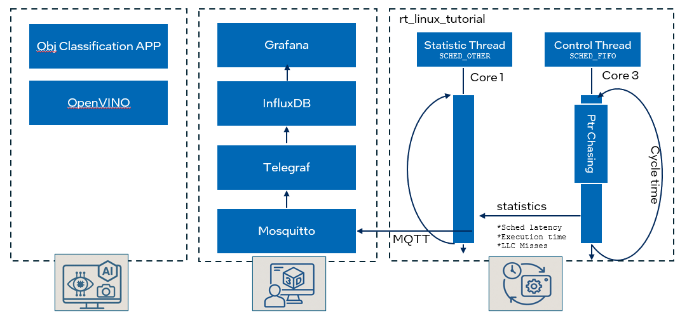

# Exploring 3 Fundamentals of Intel TCC

## Key Takeaways of this Tutorial
- **Intel® TCC Mode in BIOS/SBL**
- **Linux Kernel Command-line tuning**
- **Cache Partitioning - Intel® CAT**
- **Boost RT Performance - Intel® Speed Shift for Edge**

## Validated hardware
- CPU: Intel® Core™ i5-1350PE processors
- RAM: 16GB
- DISK: 128GB

## Test Application
This application is used to demonstrate the possible optimization steps to increase temporal isolaten between best effort workloads like AI for data analytics or predictive maintenance and real time workloads on Linux systems. It includes a control task that performs random pointer chasing to simulate a workload and measures scheduling jitter, execution time and cache misses. The application also features a statistics handler thread that processes and logs timing information. The statistics are either output to the console via stdout or sent to Grafana via MQTT. The Grafana pipeline and an OpenVINO AI based object classification model represent the best-effort workloads on the system.

<span style="color:red"> Note: The pointer chasing buffer size should exceed the L2 cache size of your processor to see an improvment by cache partitioning described in step 2 below. You can change the buffer size in `rt_linux_tutorial.c` using `WORKLOAD_BUFFER_SIZE` definev.</span>

## High-level Design of the test application

<p align="center">
  
</p>

```sh
    sudo rt_linux_tutorial -i 1000 -s 1
    Options:
      -h        Display this help message
      -i <time> Set the cycle time of the control thread in microseconds - default is 500us
      -s <0|1>  Set the output method for statistics (0 for stdout, 1 for MQTT to localhost) - default stdout
```
___
## Quick Start

### Dependencies 
This sections outlines the steps and components required to set up the system and build the test application.

### Components

- **MSR Tools**: A driver and utilities to read and write Model-Specific Registers.
- **Paho MQTT C Client Library**: A {.tabset}client library for MQTT messaging in C applications.
- **cJSON Library**: A Ultralightweight JSON parser in ANSI C.
- **Telegraf**: An agent for collecting and reporting metrics and data.
- **InfluxDB**: A time-series database designed to handle high write and query loads.
- **Grafana**: An open-source platform for monitoring and observability that allows you to visualize data.
- **OpenVino**: An open-source toolkit developed by Intel for optimizing and deploying deep learning inference workloads. It enables developers to accelerate AI inference on various Intel hardware, including CPUs, GPUs, and NPUs.

### Setup Steps

#### Install Ubuntu OS
a. Install the latest [Ubuntu* 24.04 LTS Desktop](https://releases.ubuntu.com/noble/). Refer to [Ubuntu Desktop installation tutorial](https://ubuntu.com/tutorials/install-ubuntu-desktop#1-overview) if needed.

b. Install Ubuntu real-time kernel. Real-time Ubuntu is available via Ubuntu Pro. A free [Ubuntu Pro account](https://ubuntu.com/pro/dashboard) is available for personal and small-scale commercial use. With an free Ubuntu Pro subscription you have up to five personal token for up to five machines. The kernel can simply installed by ...
```bash
pro attach <token>
pro enable realtime-kernel
```
Refer to [A CTO's guide to real-time Linux](https://ubuntu.com/engage/cto-guide-real-time-kernel) for more details. 

----
#### Install Docker and Docker Compose 
Please follow the steps described in [Install Docker Engine on Ubuntu](https://docs.docker.com/engine/install/ubuntu/) to install docker.

Please follow the steps described in [Install the Docker Compose standalone](https://docs.docker.com/compose/install/standalone/) for instance to install docker-compose.

----
#### Start the Grafana Statistics Infrastructure using docker-compose
```bash
git clone https://github.com/intel/edge-developer-kit-reference-scripts.git .

cd edge-developer-kit-reference-scripts/usecases/real-time/tcc_tutorial/docker/docker-compose

docker-compose up -d 

### Verify the services - you should see telegraf, grafana, influxdb and mosquitto container up and running
docker ps
```
Once the containers are up and running, you can connect to Grafana by following these steps:
- Open Your Web Browser: Open your preferred web browser.
- Navigate to Grafana: Enter the following URL in the address bar:

```bash
http://localhost:3000
```
If you are running Docker on a remote server, replace localhost with the server's IP address or domain name.

- Log In to Grafana: You will be prompted to log in. Use the following credentials:

```bash
    Username: admin
    Password: admin1
```
You should see a similar dashboard like the screenshot above. If the dashboard is not visible per default you should find `rt_linux_tutorial` dashboard under the `Provisioned Dashboards`in the Dashboards menu.

----
#### Build the docker image for the RT Linux Tutorial
To build the Docker image, run the following command in the directory containing your Dockerfile:

```bash
cd edge-developer-kit-reference-scripts/usecases/real-time/tcc_tutorial/
docker build -t rt_linux_tutorial_image -f docker/Dockerfile.rt .
```
Run the Docker container in interactive mode, to start the rt_linux_tutorial app:
```bash
 docker run -it --privileged --rm --network docker-compose_stats rt_linux_tutorial_image

./rt_linux_tutorial -i 1000 -s 1

 ```
 -----
#### Build the docker image for the AI Object Classification Demo from OpenVINO Model Zoo
To build the Docker image, run the following command in the directory containing your Dockerfile:

```bash
cd edge-developer-kit-reference-scripts/usecases/real-time/tcc_tutorial/
docker build -t ai_obj_class_demo_image -f docker/Dockerfile.ai .
```
Run the Docker container in interactive mode, to start the classification_demo app:
```bash
 sudo docker run --rm --privileged -e DISPLAY=$DISPLAY -v /tmp/.X11-unix:/tmp/.X11-unix -it obj_class /bin/bash

python3 classification_demo.py --device GPU -m /workspace/open_model_zoo/tools/model_tools/public/resnet-50-tf/FP32/resnet-50-tf.xml -i /workspace/fruit-and-vegetable-detection.mp4 --label /workspace/open_model_zoo/data/dataset_classes/imagenet_2012.txt

Options: 
  --device select the device used for inferencing.

 ```
By following these steps, you should have a fully functional data pipeline that collects data from a C application, sends it via MQTT, processes it with Telegraf, stores it in InfluxDB, and visualizes it with Grafana.

## NEXT Step: [Start with the Tutorial](Tutorial.md)