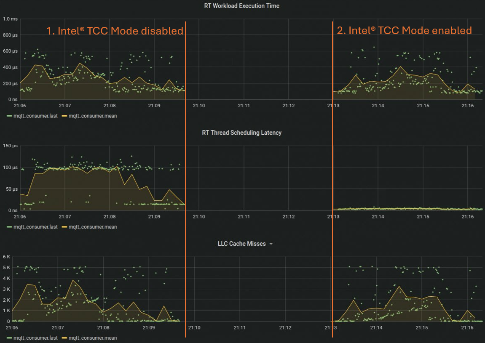

## 1. Intel® TCC Mode

In the first step, let's take a look at the <span style="font-family: 'Courier New';">Intel® TCC Mode</span> and how this single UEFI BIOS/Slim Bootloader (SBL) knob can help quickly optimize firmware settings for low latency. The <span style="font-family: 'Courier New';">Intel® TCC Mode</span> should be avialble on all Intel® TCC enabled platforms. With the Intel® reference BIOS, you can enable <span style="font-family: 'Courier New';">Intel® TCC Mode</span> by navigating to <span style="font-family: 'Courier New';">"Intel® Advanced Menu > Time Coordinated Computing"</span>. 

If <span style="font-family: 'Courier New';">Intel® TCC Mode</span> is not visible, consult your board vendor or follow the steps listed in the "Intel® Core Processors Firmware Configuration" section of [TCC User Guide](https://cdrdv2.intel.com/v1/dl/getContent/831067) to set the options manually.

<span style="font-family: 'Courier New';">Intel® TCC Mode</span> includes a wide range of real-time optimizations including the following:
- Power Management, for example:
  - Handling of power states 
  - Optimization of frequency transtions 
- Configuration of TCC features, for example:
  - Limiting amount of cache available to the GPU.
  - Setting up virtual channels for VC-capable endpoints.

Now, let's take a concrete example and see how the <span style="font-family: 'Courier New';">Intel® TCC Mode</span> optimizes power states for low latency. To do this, we will compare the statistics of the test application with the default settings of the Intel® reference BIOS, which includes <span style="font-family: 'Courier New';">Intel® TCC Mode</span> disabled, and with <span style="font-family: 'Courier New';">Intel® TCC Mode</span> enabled.

For this example, we use an Intel® Core™ i5-1350PE processor with the Ubuntu real-time kernel. The following command line parameters are used for real-time optimization:

<span style="font-family: 'Courier New';">clocksource=tsc tsc=reliable nmi_watchdog=0 nosoftlockup isolcpus=3 rcu_nocbs=3 nohz_full=3 irqaffinity=0</span>

- <span style="font-family: 'Courier New';">clocksource=tsc</span>: Sets the Time Stamp Counter (TSC) as the clock source for better precision.
- <span style="font-family: 'Courier New';">tsc=reliable</span>: Marks the TSC as reliable, ensuring it is used consistently.
- <span style="font-family: 'Courier New';">nmi_watchdog=0</span>: Disables the Non-Maskable Interrupt (NMI) watchdog to reduce latency.
- <span style="font-family: 'Courier New';">nosoftlockup</span>: Disables the soft lockup detector to prevent unnecessary interruptions.
- <span style="font-family: 'Courier New';">isolcpus=3</span>: Isolates CPU core 3 from the general scheduler, dedicating it to real-time tasks.
- <span style="font-family: 'Courier New';">rcu_nocbs=3</span>: Prevents the specified CPU core (3) from handling RCU (Read-Copy-Update) callbacks, reducing latency.
- <span style="font-family: 'Courier New';">nohz_full=3</span>: Enables full dynamic ticks on CPU core 3, reducing timer interrupts.
- <span style="font-family: 'Courier New';">irqaffinity=0</span>: Directs all hardware interrupts to CPU core 0, keeping core 3 free for real-time tasks.

The block diagram below illustrates the setup used for the <span style="font-family: 'Courier New';">Intel® TCC Mode</span> analysis.
<p align="center">
  
</p>
 
#### Execution and Analysis
1. Boot the system with the default BIOS options, start the real-time application with a cycle time of 1ms, and output the statistics to the Grafana dashboard. Let the test application run for some seconds and monitor the statistics.

  ```sh
  sudo ./rt_linux_tutorial -i 1000 -s 1
  ```
2. Reboot the system and enable <span style="font-family: 'Courier New';">Intel® TCC Mode</span> in BIOS. Then, restart the test application with the same command line as before.
<p align="center">
  
</p>

Looking at the performance metrics of the real-time application - execution time, scheduling jitter, and cache misses - shows that, in general, all three are still a bit noisy.
The most significant change can be observed in the scheduling jitter of the real-time thread. With <span style="font-family: 'Courier New';">Intel® TCC Mode</span> disabled, the average scheduling jitter is around 100µs, while with <span style="font-family: 'Courier New';">Intel® TCC Mode</span> enabled, the jitter is in the sub-10µs range.

The improvement is a result of the power state optimizations of the <span style="font-family: 'Courier New';">Intel® TCC Mode</span>. The <span style="font-family: 'Courier New';">Intel® TCC Mode</span> disables C-States and all related sub-configuration options.  

C-States are power-saving modes in x86 processors that reduce power consumption and thermal output by varying the levels of inactivity and shutting down different parts of the CPU when it is idle. Each C-State has a target residency, which is the minimum amount of time the CPU should remain in that state, and an exit latency, which is the time it takes for the CPU to return to an active state (C0) from that power-saving mode. Deeper C-States provide greater power savings but have higher exit latencies, meaning it takes longer for the CPU to become fully operational again. To check if C-States are enabled, see which C-States are supported, and view their target residency and exit latency, you can use a small scipt like this for example:
```sh
for cpu in /sys/devices/system/cpu/cpu*/cpuidle/state*; do
    echo -n "$cpu: "; cat $cpu/name
    echo -n "  Target residency: "; cat $cpu/residency
    echo -n "  Exit latency: "; cat $cpu/latency
    echo -n "  State [disabled=1 enabled=0]: "; cat $cpu/disable
done
```
In the test case above, the core is isolated, meaning only the real-time application is running on the physical core. The average execution latency is around 300µs, and the cycle time is 1ms. This results in the core idling for approximately 700µs most of the time, allowing the Linux idle subsystem to send the core to a deeper C-State to save power. Deeper C-States have higher exit latencies, which is why the scheduling jitter is significantly higher.
Keep in mind that this is one example. The behavior highly depends on the workload characteristics and the overall use-case. However, this example demonstrates that <span style="font-family: 'Courier New';">Intel® TCC Mode</span> makes it easy to optimize the processor for low latency with just one setting in the firmware.

Now, let's see how you can further optimize real-time performance and improve temporal isolation between best-effort workloads and the real-time application using Intel® TCC features.

### 2. Intel® Cache Allocation Technology 
In the second step, assume a system architecture where workloads with varying Quality of Service (QoS) requirements are consolidated on a single processor. This includes best-effort workloads, such as User Interface (UI) or Artificial Intelligence (AI) tasks, as well as real-time workloads, like the real-time test application. In such designs, shared resources like cache can become potential sources of contention.

Let's take a look at how Intel® Cache Allocation Technology (CAT) can help mitigate these sources of contention. CAT provides the ability to partition caches at various levels in the caching hierarchy. For example, consider the cache architecture of the Intel® Core™ i5-1350PE processor illustrated below. Initially, the default cache configuration is used, where all cache ways are shared. In the second step, the statistics are compared with the Last Level Cache (LLC) partitioned to provide an exclusive portion of the cache to the real-time test application. In both scenarios, a memory-centric workload on the best-effort cores is simulated using stress-ng.

<p align="center">
  
</p>

#### Execution and Analysis
1. Start the real-time application if it is not already running, and output the statistics to the Grafana dashboard. Monitor the statistics and start in a second terminal the AI object classification demo from OpenVINO™ model zoo.

  ```sh
  sudo ./rt_linux_tutorial -i 1000 -s 1
  ```
  ```sh
  sudo docker run --rm --privileged -e DISPLAY=$DISPLAY -v /tmp/.X11-unix:/tmp/.X11-unix -it demo_obj_classification /bin/bash
  sudo python3 classification_demo.py --device GPU -m /workspace/open_model_zoo/tools/model_tools/public/resnet-50-tf/FP32/resnet-50-tf.xml -i /workspace/fruit-and-vegetable-detection.mp4 --label /workspace/open_model_zoo/data/dataset_classes/imagenet_2012.txt
```
You can use the following command as an alternative to the AI object classification demo:

```sh
  stress-ng --vm 8 --vm-bytes 128M --fork 4
  Options:
    -vm 8: This parameter specifies that 8 virtual memory stressor instances should be started. Each instance will allocate and stress test memory.
    -vm-bytes 128M: This parameter specifies the amount of memory each virtual memory stressor instance should allocate. In this case, each of the 8 instances will allocate 128 megabytes of memory.
    -fork 4: This parameter specifies that 4 child processes should be forked. Each child process will execute the stress test independently.
  ```
2. Partition the Last Level Cache (LLC) and assign an exclusive portion of the cache to the real-time test application, as demonstrated for the Intel® Core™ i5-1350PE above. Here is how the LLC can be partitioned using the Linux* `msr-tools`:
  ```sh
    #define LLC Core Masks
    wrmsr 0xc90 0x30 # best effort mask
    wrmsr 0xc91 0xFC # real-time mask
    #define LLC GT Mask 
    wrmsr 0x18b0 0x80 # iGPU mask
    
    #assign the masks to the cores.
    #This has to match with the core selected for the rt app
    wrmsr -a 0xc8f 0x0 # assign all cores to the CLOS0 
    wrmsr -p 3 0xc8f 0x100000000 # assign real-time core to CLOS1

    #There is also the pqos Linux* command-line utility which is part of the intel-cmt-cat package which can be used.
  ```
  
Alternatively, you can use the script with the `rt_optimized` option to partition the cache as demonstrated above, or with the `default` option for flat partitioning.
  ```sh
  sudo ./setCacheAllocation.sh rt_optimized
  ```  
  <span style="color:red"> Note: The script and the masks defined above are examples tailored for the cache topology of the Intel® Core™ i5-1350PE processor and the specific use-case. You may need to adapt them to match the cache topology of your processor and use-case.</span>
<p align="center">
  
</p>

Examining the performance metrics of the real-time application shows that, in the initial phase, the cores running the best-effort workloads are mostly idling. During this phase, the execution time is very consistent and within a reasonable range. However, when stress-ng starts, both the execution time and the number of LLC misses increase significantly as you can see in step 1b. This occurs because the data of the real-time application is frequently evicted from the LLC and must be fetched from the main memory.
As demonstrated in the second step of the measurement, applying cache partitioning helps reduce the LLC misses for the real-time application, bringing the execution time back to a reasonable range.

As demonstrated, partitioning the cache using Intel® Cache Allocation Technology (CAT) is a straightforward way to improve temporal isolation between real-time and best-effort workloads.

This is just an example, and the configuration needs to be adjusted to your specific use case and processor. You can determine the cache topology, including the size and number of ways supported for a particular processor, by using the CPUID leaf "Deterministic Cache Parameters Leaf - 0x4." Additionally, Linux* utilities like lstopo are very useful for getting an overview of the cache topology of a processor. Here are some references if you need more information about CAT ...
  
  - Public Intel® Time Coordinated Computing (TCC) User Guide - RDC #[831067](https://cdrdv2.intel.com/v1/dl/getContent/831067)
  - Intel® Resource Director Technology (Intel® RDT) Architecture Specification - RDC #[789566](https://cdrdv2.intel.com/v1/dl/getContent/789566)
  - Intel® 64 and IA-32 Architectures Software Developer’s Manual - RDC#[671200](https://cdrdv2.intel.com/v1/dl/getContent/671200)
  
### 3. Intel® Speed Shift Technology for Edge Computing

In the third and final step of this tutorial, let's examine another aspect of power management: Performance states, or P-States. P-States enable the scaling of the processor's frequency and voltage to reduce CPU power consumption. They are part of Dynamic Voltage and Frequency Scaling (DVFS) features such as Intel® Speed Step, Speed Shift, and Turbo Boost Technology. Speed Step and Speed Shift adjust the processor's voltage and frequency within these P-States to balance power efficiency and performance, while Turbo Boost allows the processor to temporarily exceed the highest P-State to provide additional performance during demanding tasks.

Until the 11th generation of Intel Core processors, it was recommended for hard real-time use cases to disable all DVFS features in the BIOS, which would lock the frequency of all cores permanently to the base frequency. Starting with the 11th generation of Intel Core processors, P-State transitions were optimized. As a result, from the 11th generation onward, Intel® Speed Step, Speed Shift, and Turbo Boost Technology are no longer disabled if you enable <span style="font-family: 'Courier New';">Intel® TCC Mode</span> in the BIOS. You still have the option to lock core frequency during runtime using the HWP MSRs or the intel_pstate driver under Linux.

With this knowledge, let's revisit the performance metrics. First, lock the core frequency of all cores to the base frequency. In the second step, boost the frequency of the real-time core to a value within the turbo frequency range to leverage higher single-threaded performance. Here let's follow the recommendations for the enveloping frequency configurations which are listed in the [TCC User Guide](https://cdrdv2.intel.com/v1/dl/getContent/831067) for the specific processor SKU.

More information about HWP and the MSR can be found in the Intel® 64 and IA-32 Architectures Software Developer’s Manual Vol3 section "Power and Thermal Management-Hardware Controlled Performance States - RDC#[671200](https://cdrdv2.intel.com/v1/dl/getContent/671200) 

<p align="center">
  
</p>

#### Execution and Analysis

1.  Start the real-time application if it is not already running, and output the statistics to the Grafana dashboard. Monitor the statistics and start in a second terminal the AI object classification demo from OpenVINO™ model zoo.
  ```sh
  sudo ./rt_linux_tutorial -i 1000 -s 1
  ```
```sh
  sudo docker run --rm --privileged -e DISPLAY=$DISPLAY -v /tmp/.X11-unix:/tmp/.X11-unix -it demo_obj_classification /bin/bash
  sudo python3 classification_demo.py --device GPU -m /workspace/open_model_zoo/tools/model_tools/public/resnet-50-tf/FP32/resnet-50-tf.xml -i /workspace/fruit-and-vegetable-detection.mp4 --label /workspace/open_model_zoo/data/dataset_classes/imagenet_2012.txt
```
You can use the following command as an alternative to the AI object classification demo:

```sh
  stress-ng --vm 8 --vm-bytes 128M --fork 4
  Options:
    -vm 8: This parameter specifies that 8 virtual memory stressor instances should be started. Each instance will allocate and stress test memory.
    -vm-bytes 128M: This parameter specifies the amount of memory each virtual memory stressor instance should allocate. In this case, each of the 8 instances will allocate 128 megabytes of memory.
    -fork 4: This parameter specifies that 4 child processes should be forked. Each child process will execute the stress test independently.
  ```
  Ensure that CAT partitioning is still applied or run the following script again.
  
  ```sh
  sudo ./setCacheAllocation.sh rt_optimized
  ```  

2. Lock the core frequency of all cores to base frequency of the core and tune the Energy Performance Preferences (EPP) towords `performance` this complies with disabling DVFS features in BIOS. Here is an example how you can use the sysfs entries of intel_pstate driver ...

```sh
# Loop through each CPU core and set the min and max frequencies to base frequency
for CPU in /sys/devices/system/cpu/cpu[0-11]*; do
    BASE_FREQUENCY=$(cat $CPU/cpufreq/base_frequency)
    echo $BASE_FREQUENCY | sudo tee $CPU/cpufreq/scaling_min_freq
    echo $BASE_FREQUENCY | sudo tee $CPU/cpufreq/scaling_max_freq
    echo performance | sudo tee $CPU/cpufreq/energy_performance_preference
done
```
Alternatively, you can use the script with `basefrequency`parameter ...

```sh
sudo ./setsetCoreFrequency.sh basefrequency
``` 
3. Boost the frequency of the core running the real-time application as described in the enveloping configuration in the TCC User Guide. In this configuration, the maximum allowed frequency of all best-effort cores is limited to the base frequency, and the Energy Performance Preferences (EPP) is set to power. This setup allows the best-effort cores to scale their frequency between the minimum and base frequency depending on core utilization. For the real-time core, the frequency is boosted to 3.1 GHz, and the EPP is set to performance to ensure Quality of Service (QoS) in case of power limit throttling.
Use the script with `rt-boost`, followed by the identfier of the real-time core and the desired core frequency ...

  ```sh
  sudo ./setsetCoreFrequency.sh rt-boost '3' 3100000 3100000
  ``` 
  <span style="color:red"> Note: The script and the specified frequencies are examples tailored for this tutorial and the Intel® Core™ i5-1350PE processor. You may need to adapt them to match your processor and use case.</span>

For more information on directly accessing the HWP MSR instead of using the sysfs entries of the intel_pstate driver, please refer to the [TCC User Guide](https://cdrdv2.intel.com/v1/dl/getContent/831067) and in the Intel® 64 and IA-32 Architectures Software Developer’s Manual Vol3 section "Power and Thermal Management-Hardware Controlled Performance States - RDC#[671200](https://cdrdv2.intel.com/v1/dl/getContent/671200) 

<p align="center">
  
</p>
Examining the performance metrics, you can observe the following:

- In the first step of the graph, where HWP was still able to scale the P-State, the execution time jitter band remains noisy.
- Step 2 shows that locking the frequency of all cores to the base frequency reduces the jitter band but also significantly increases the execution time.
- Finally, in step 3, locking the core frequency of the core running the real-time application to a turbo frequency and limiting the maximum allowed frequency of the best-effort (BE) cores to the base frequency, following the guidance of the enveloping configurations listed in the TCC User Guide, results in a narrower execution time jitter band and a significantly lower execution time.


As you can see, locking the core frequency of the core running the real-time application helps reduce execution time jitter. Additionally, boosting the core frequency of the real-time core can be highly beneficial for use cases that require higher single-threaded performance.

### Conclusion

In this tutorial, three easy-to-use features of the Intel® TCC toolbox, along with some kernel command line parameters, were introduced to optimize real-time performance. These features and techniques help system integrators quickly tune the system for specific real-time use cases:
- TCC Mode: Optimizes firmware for low latency with a single configuration knob.
- Cache Allocation Technology (CAT): Enables quick partitioning of the cache to improve temporal isolation.
- Speed Shift for Edge Computing: Can be used to boost single-threaded performance.

By leveraging these tools, system integrators can efficiently enhance the performance and reliability of their real-time applications.

<span style="color:red"> Note: Please keep in mind that performance varies by use, configuration and other factors. Learn more at www.Intel.com/PerformanceIndexPerformance results are based on testing as of dates shown in configurations and may not reflect all publicly available updates.  No product or component can be absolutely secure</span>

### 2. Intel® Cache Allocation Technology 
In the second step, assume a system architecture where workloads with varying Quality of Service (QoS) requirements are consolidated on a single processor. This includes best-effort workloads, such as User Interface (UI) or Artificial Intelligence (AI) tasks, as well as real-time workloads, like the real-time test application. In such designs, shared resources like cache can become potential sources of contention.

Let's take a look at how Intel® Cache Allocation Technology (CAT) can help mitigate these sources of contention. CAT provides the ability to partition caches at various levels in the caching hierarchy. For example, consider the cache architecture of the Intel® Core™ i5-1350PE processor illustrated below. Initially, the default cache configuration is used, where all cache ways are shared. In the second step, the statistics are compared with the Last Level Cache (LLC) partitioned to provide an exclusive portion of the cache to the real-time test application. In both scenarios, a memory-centric workload on the best-effort cores is simulated using stress-ng.

<p align="center">
  
</p>

#### Execution and Analysis
1. Start the real-time application if it is not already running, and output the statistics to the Grafana dashboard. Monitor the statistics and start in a second terminal the AI object classification demo from OpenVINO model zoo.

  ```sh
  sudo ./rt_linux_tutorial -i 1000 -s 1
  ```
  ```sh
  sudo docker run --rm --privileged -e DISPLAY=$DISPLAY -v /tmp/.X11-unix:/tmp/.X11-unix -it demo_obj_classification /bin/bash
  sudo python3 classification_demo.py --device GPU -m /workspace/open_model_zoo/tools/model_tools/public/resnet-50-tf/FP32/resnet-50-tf.xml -i /workspace/fruit-and-vegetable-detection.mp4 --label /workspace/open_model_zoo/data/dataset_classes/imagenet_2012.txt
```
You can use the following command as an alternative to the AI object classification demo:

```sh
  stress-ng --vm 8 --vm-bytes 128M --fork 4
  Options:
    -vm 8: This parameter specifies that 8 virtual memory stressor instances should be started. Each instance will allocate and stress test memory.
    -vm-bytes 128M: This parameter specifies the amount of memory each virtual memory stressor instance should allocate. In this case, each of the 8 instances will allocate 128 megabytes of memory.
    -fork 4: This parameter specifies that 4 child processes should be forked. Each child process will execute the stress test independently.
  ```
2. Partition the Last Level Cache (LLC) and assign an exclusive portion of the cache to the real-time test application, as demonstrated for the Intel® Core™ i5-1350PE above. Here is how the LLC can be partitioned using the Linux `msr-tools`:
  ```sh
    #define LLC Core Masks
    wrmsr 0xc90 0x30 # best effort mask
    wrmsr 0xc91 0xFC # real-time mask
    #define LLC GT Mask 
    wrmsr 0x18b0 0x80 # iGPU mask
    
    #assign the masks to the cores.
    #This has to match with the core selected for the rt app
    wrmsr -a 0xc8f 0x0 # assign all cores to the CLOS0 
    wrmsr -p 3 0xc8f 0x100000000 # assign real-time core to CLOS1

    #There is also the pqos Linux command-line utility which is part of the intel-cmt-cat package which can be used.
  ```
  
Alternatively, you can use the script with the `rt_optimized` option to partition the cache as demonstrated above, or with the `default` option for flat partitioning.
  ```sh
  sudo ./setCacheAllocation.sh rt_optimized
  ```  
  <span style="color:red"> Note: The script and the masks defined above are examples tailored for the cache topology of the Intel® Core™ i5-1350PE processor and the specific use-case. You may need to adapt them to match the cache topology of your processor and use-case.</span>
<p align="center">
  
</p>

Examining the performance metrics of the real-time application shows that, in the initial phase, the cores running the best-effort workloads are mostly idling. During this phase, the execution time is very consistent and within a reasonable range. However, when stress-ng starts, both the execution time and the number of LLC misses increase significantly as you can see in step 1b. This occurs because the data of the real-time application is frequently evicted from the LLC and must be fetched from the main memory.
As demonstrated in the second step of the measurement, applying cache partitioning helps reduce the LLC misses for the real-time application, bringing the execution time back to a reasonable range.

As demonstrated, partitioning the cache using Intel® Cache Allocation Technology (CAT) is a straightforward way to improve temporal isolation between real-time and best-effort workloads.

This is just an example, and the configuration needs to be adjusted to your specific use case and processor. You can determine the cache topology, including the size and number of ways supported for a particular processor, by using the CPUID leaf "Deterministic Cache Parameters Leaf - 0x4." Additionally, Linux* utilities like lstopo are very useful for getting an overview of the cache topology of a processor. Here are some references if you need more information about CAT ...
  
  - Public Intel® Time Coordinated Computing (TCC) User Guide - RDC #[831067](https://cdrdv2.intel.com/v1/dl/getContent/831067)
  - Intel® Resource Director Technology (Intel® RDT) Architecture Specification - RDC #[789566](https://cdrdv2.intel.com/v1/dl/getContent/789566)
  - Intel® 64 and IA-32 Architectures Software Developer’s Manual - RDC#[671200](https://cdrdv2.intel.com/v1/dl/getContent/671200)

 ### 3. Intel® Speed Shift Technology for Edge Computing

In the third and final step of this tutorial, let's examine another aspect of power management: Performance states, or P-States. P-States enable the scaling of the processor's frequency and voltage to reduce CPU power consumption. They are part of Dynamic Voltage and Frequency Scaling (DVFS) features such as Intel® Speed Step, Speed Shift, and Turbo Boost Technology. Speed Step and Speed Shift adjust the processor's voltage and frequency within these P-States to balance power efficiency and performance, while Turbo Boost allows the processor to temporarily exceed the highest P-State to provide additional performance during demanding tasks.

Until the 11th generation of Intel Core processors, it was recommended for hard real-time use cases to disable all DVFS features in the BIOS, which would lock the frequency of all cores permanently to the base frequency. Starting with the 11th generation of Intel Core processors, P-State transitions were optimized. As a result, from the 11th generation onward, Intel® Speed Step, Speed Shift, and Turbo Boost Technology are no longer disabled if you enable <span style="font-family: 'Courier New';">Intel® TCC Mode</span> in the BIOS. You still have the option to lock core frequency during runtime using the HWP MSRs or the intel_pstate driver under Linux.

With this knowledge, let's revisit the performance metrics. First, lock the core frequency of all cores to the base frequency. In the second step, boost the frequency of the real-time core to a value within the turbo frequency range to leverage higher single-threaded performance. Here let's follow the recommendations for the enveloping frequency configurations which are listed in the [TCC User Guide](https://cdrdv2.intel.com/v1/dl/getContent/831067) for the specific processor SKU.

More information about HWP and the MSR can be found in the Intel® 64 and IA-32 Architectures Software Developer’s Manual Vol3 section "Power and Thermal Management-Hardware Controlled Performance States - RDC#[671200](https://cdrdv2.intel.com/v1/dl/getContent/671200) 

<p align="center">
  
</p>

#### Execution and Analysis

1.  Start the real-time application if it is not already running, and output the statistics to the Grafana dashboard. Monitor the statistics and start in a second terminal the AI object classification demo from OpenVINO™ model zoo.
  ```sh
  sudo ./rt_linux_tutorial -i 1000 -s 1
  ```
```sh
  sudo docker run --rm --privileged -e DISPLAY=$DISPLAY -v /tmp/.X11-unix:/tmp/.X11-unix -it demo_obj_classification /bin/bash
  sudo python3 classification_demo.py --device GPU -m /workspace/open_model_zoo/tools/model_tools/public/resnet-50-tf/FP32/resnet-50-tf.xml -i /workspace/fruit-and-vegetable-detection.mp4 --label /workspace/open_model_zoo/data/dataset_classes/imagenet_2012.txt
```
You can use the following command as an alternative to the AI object classification demo:

```sh
  stress-ng --vm 8 --vm-bytes 128M --fork 4
  Options:
    -vm 8: This parameter specifies that 8 virtual memory stressor instances should be started. Each instance will allocate and stress test memory.
    -vm-bytes 128M: This parameter specifies the amount of memory each virtual memory stressor instance should allocate. In this case, each of the 8 instances will allocate 128 megabytes of memory.
    -fork 4: This parameter specifies that 4 child processes should be forked. Each child process will execute the stress test independently.
  ```
  Ensure that CAT partitioning is still applied or run the following script again.
  
  ```sh
  sudo ./setCacheAllocation.sh rt_optimized
  ```  

2. Lock the core frequency of all cores to base frequency of the core and tune the Energy Performance Preferences (EPP) towords `performance` this complies with disabling DVFS features in BIOS. Here is an example how you can use the sysfs entries of intel_pstate driver ...

```sh
# Loop through each CPU core and set the min and max frequencies to base frequency
for CPU in /sys/devices/system/cpu/cpu[0-11]*; do
    BASE_FREQUENCY=$(cat $CPU/cpufreq/base_frequency)
    echo $BASE_FREQUENCY | sudo tee $CPU/cpufreq/scaling_min_freq
    echo $BASE_FREQUENCY | sudo tee $CPU/cpufreq/scaling_max_freq
    echo performance | sudo tee $CPU/cpufreq/energy_performance_preference
done
```
Alternatively, you can use the script with `basefrequency`parameter ...

```sh
sudo ./setsetCoreFrequency.sh basefrequency
``` 
3. Boost the frequency of the core running the real-time application as described in the enveloping configuration in the TCC User Guide. In this configuration, the maximum allowed frequency of all best-effort cores is limited to the base frequency, and the Energy Performance Preferences (EPP) is set to power. This setup allows the best-effort cores to scale their frequency between the minimum and base frequency depending on core utilization. For the real-time core, the frequency is boosted to 3.1 GHz, and the EPP is set to performance to ensure Quality of Service (QoS) in case of power limit throttling.
Use the script with `rt-boost`, followed by the identfier of the real-time core and the desired core frequency ...

  ```sh
  sudo ./setsetCoreFrequency.sh rt-boost '3' 3100000 3100000
  ``` 
  <span style="color:red"> Note: The script and the specified frequencies are examples tailored for this tutorial and the Intel® Core™ i5-1350PE processor. You may need to adapt them to match your processor and use case.</span>

For more information on directly accessing the HWP MSR instead of using the sysfs entries of the intel_pstate driver, please refer to the [TCC User Guide](https://cdrdv2.intel.com/v1/dl/getContent/831067) and in the Intel® 64 and IA-32 Architectures Software Developer’s Manual Vol3 section "Power and Thermal Management-Hardware Controlled Performance States - RDC#[671200](https://cdrdv2.intel.com/v1/dl/getContent/671200) 

<p align="center">
  
</p>
Examining the performance metrics, you can observe the following:

- In the first step of the graph, where HWP was still able to scale the P-State, the execution time jitter band remains noisy.
- Step 2 shows that locking the frequency of all cores to the base frequency reduces the jitter band but also significantly increases the execution time.
- Finally, in step 3, locking the core frequency of the core running the real-time application to a turbo frequency and limiting the maximum allowed frequency of the best-effort (BE) cores to the base frequency, following the guidance of the enveloping configurations listed in the TCC User Guide, results in a narrower execution time jitter band and a significantly lower execution time.


As you can see, locking the core frequency of the core running the real-time application helps reduce execution time jitter. Additionally, boosting the core frequency of the real-time core can be highly beneficial for use cases that require higher single-threaded performance.

### Conclusion

In this tutorial, three easy-to-use features of the Intel® TCC toolbox, along with some kernel command line parameters, were introduced to optimize real-time performance. These features and techniques help system integrators quickly tune the system for specific real-time use cases:
- TCC Mode: Optimizes firmware for low latency with a single configuration knob.
- Cache Allocation Technology (CAT): Enables quick partitioning of the cache to improve temporal isolation.
- Speed Shift for Edge Computing: Can be used to boost single-threaded performance.

By leveraging these tools, system integrators can efficiently enhance the performance and reliability of their real-time applications.


<span style="color:red"> Note: Please keep in mind that performance varies by use, configuration and other factors. Learn more at www.Intel.com/PerformanceIndexPerformance results are based on testing as of dates shown in configurations and may not reflect all publicly available updates.  No product or component can be absolutely secure</span> 
